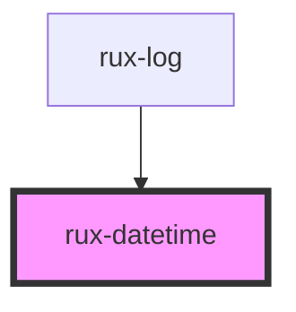

# rux-datetime

RuxDatetime is a utility component that provides a convenient wrapper around the [Intl.DateTimeFormat](https://developer.mozilla.org/en-US/docs/Web/JavaScript/Reference/Global_Objects/Intl/DateTimeFormat) API.

<!-- Auto Generated Below -->


## Usage

### Simple

```html
<rux-datetime
    date="Fri Jun 18 2021 13:50:02 GMT-0400 (Eastern Daylight Time)"
    year="2-digit"
    month="2-digit"
    day="2-digit"
    hour="2-digit"
    minute="2-digit"
    second="2-digit"
    hour-12="true"
    time-zone="America/Los_Angeles"
>
</rux-datetime>
```


## Properties

| Property       | Attribute        | Description                      | Type                                                                   | Default      |
| -------------- | ---------------- | -------------------------------- | ---------------------------------------------------------------------- | ------------ |
| `date`         | `date`           | The date time to be formatted    | `Date \| string`                                                       | `new Date()` |
| `day`          | `day`            | Format options for day           | `"2-digit" \| "numeric" \| undefined`                                  | `undefined`  |
| `era`          | `era`            | Format options for era           | `"long" \| "narrow" \| "short" \| undefined`                           | `undefined`  |
| `hour`         | `hour`           | Format options for hour          | `"2-digit" \| "numeric" \| undefined`                                  | `undefined`  |
| `hour12`       | `hour-12`        | Display date in 12 hour time.    | `boolean`                                                              | `false`      |
| `locale`       | `locale`         | The locale                       | `string`                                                               | `'default'`  |
| `minute`       | `minute`         | Format options for minute        | `"2-digit" \| "numeric" \| undefined`                                  | `undefined`  |
| `month`        | `month`          | Format options for month         | `"2-digit" \| "long" \| "narrow" \| "numeric" \| "short" \| undefined` | `undefined`  |
| `second`       | `second`         | Format options for second        | `"2-digit" \| "numeric" \| undefined`                                  | `undefined`  |
| `timeZone`     | `time-zone`      | Format options for Timezone      | `string \| undefined`                                                  | `undefined`  |
| `timeZoneName` | `time-zone-name` | Format options for Timezone name | `"long" \| "short" \| undefined`                                       | `undefined`  |
| `weekday`      | `weekday`        | Format options for weekday       | `"long" \| "narrow" \| "short" \| undefined`                           | `undefined`  |
| `year`         | `year`           | Format options for year          | `"2-digit" \| "numeric" \| undefined`                                  | `undefined`  |


## Dependencies

### Used by

 - [rux-log](../rux-log)

### Graph


----------------------------------------------

*Built with [StencilJS](https://stenciljs.com/)*
