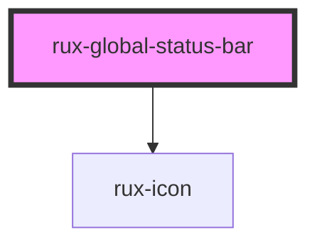

# Global Status Bar

The Global Status Bar is a full-width view across the top of an application — an area commonly reserved for global status, global command, and top-level navigation. The Global Status Bar often includes: Application Name, Application State, Monitoring Icons, Top Level Navigation, and an Emergency Button.

## Guidelines

-   [Astro UXDS: Global Status Bar](https://astrouxds.com/ui-components/global-status-bar)

## Web Components Usage

### 1. Installation

#### Install the Astro UXDS Global Status Bar package via Command Line (Preferred Method)

```sh
npm i -save @astrouxds/rux-global-status-bar
```

You may use Yarn, NPM, or your Node package manager of choice. The `--save` flag adds this component as a dependency in your `package.json` file.

#### **Alternatively**, download the [Astro UXDS Component Library](https://github.com/RocketCommunicationsInc/astro-components) source to your project.

Via CLI:

```sh
git clone https://github.com/RocketCommunicationsInc/astro-components.git
```

Or, [download the Astro UXDS Components as a .zip](https://github.com/RocketCommunicationsInc/astro-components/archive/master.zip)

### 2. Import the Astro Global Status Bar Web Component

This example assumes you're using the NPM package in `node_modules`. Otherwise, import the component using the path to the Astro Components directory in your project.

```javascript
import { RuxGlobalStatusBar } from '@astrouxds/rux-global-status-bar/rux-global-status-bar.js'
```

### 3. Render the Astro Global Status Bar Web Component

Pass properties as attributes of the Astro Global Status custom element:

```xml
 <rux-global-status-bar includeIcon=true includeAppMeta=true appDomain="ABC" appName="Astro App" appVersion="3.0"></rux-global-status-bar>
```

### 4. Using Slots

The Global Status Bar component uses both named and unnamed slots. These slots correspond to the location the slotted element will appear within the Global Status Bar.

-   [ [name="left-side"] [name="app-meta"] <-- [unnamed slot] --> [name="right-side"] ]

### Named Slots

There are three named slots in the Global Status Bar: left-side, app-meta, and right-side. These can be used by declaring a slot attribute with the corresponding value on the element you want to be placed in that slot. When the slot is used with custom markup, no optional content as described below is available.

**left-side (`<div slot="left-side" />`)**

-   Optional Content: To include the optional content of a rux-icon component in the left-side slot set the includeIcon property to true.
    ```xml
    <rux-icon icon="apps" size="small">
    ```
-   Icon Customization: To change the icon used in the optional rux-icon component, set the menuIcon property to a string matching the name of an icon in the rux-icon library. If a menuIcon property value is provided that does not match an icon in the rux-icon libary, then no icon will be displayed.

**app-meta (`<div slot="app-meta" />`)**:

-   Optional Content: To include the optional content of an AppMeta component in the app-meta slot set the appDomain, appName, or appVersion properties to a string

    ```xml
      <div class="app-meta">
        <div class="app-info-wrapper">
          {this.appDomain && <h1 class="app-domain">{domain}</h1>}
          {this.appName && <h1 class="app-name">{name}</h1>}
          {this.appVersion && <span class="app-version">{version}</span>}
        </div>
        // Optional Application State and Username components
        <div class="app-state-wrapper">
          {this.includeAppState && <div class="app-state">App state</div>}
          {this.includeUsername && <div class="username">Username</div>}
        </div>
      </div>
    ```

-   Application Domain, Name, and Version Customization: To change the text of the application domain, name or version in the AppMeta component, use the corresponding property
-   Application State Customization: To include the optional content of an AppState component in the app-meta slot set the includeAppState property to true.
-   Username Customization: To include the optional content of an Username component in the app-meta slot set the includeUsername prperty to true.

**right-side (`<div slot="right-side" />`**)

-   Optional Content: None

### Unnamed Slots

There is one unnamed slot in the Global Status Bar. This slot is intended for any other elements or components you would like placed in the status bar separate from common components such as a menu icon and application name. Any child elements of the Global Status Bar that are not named slots will be considered slotted into this unnamed slot. Status bar elements like the [Clock](https://www.astrouxds.com/ui-components/clock), [Tabs](https://www.astrouxds.com/ui-components/tabs), [Buttons](https://www.astrouxds.com/ui-components/buttons), and even plain HTML can be inserted into the body of the Global Status Bar using the component’s [slot](https://developer.mozilla.org/en-US/docs/Web/HTML/Element/slot).

```xml
 <rux-global-status-bar class="dark-theme">
    <!-- Custom elements with named slot "left-side" rendered here or the rux-icon with default value rendered if the includeIcon property is set to true-->
    <!-- Custom elements with named slot "app-meta" rendered here or the default app-meta component with appDomain, appName, and appVersion prop values -->

    <!-- Unnamed slot elements rendered here -->
    <rux-clock></rux-clock>
    <div><!-- Any HTML here --></div>

	  <!-- Custom elements with named slot "right-side" are rendered here-->
 </rux-global-status-bar>
```

<!-- Auto Generated Below -->

## Properties

| Property          | Attribute           | Description                                                                 | Type      | Default     |
| ----------------- | ------------------- | --------------------------------------------------------------------------- | --------- | ----------- |
| `appDomain`       | `app-domain`        | Sets the domain of the application to be displayed in the app-meta element  | `string`  | `undefined` |
| `appName`         | `app-name`          | Sets the name of the application to be displayed in the app-meta element    | `string`  | `undefined` |
| `appVersion`      | `app-version`       | Sets the version of the application to be displayed in the app-meta element | `string`  | `undefined` |
| `includeAppState` | `include-app-state` | Declares whether the app-state component will be shown in the app-meta slot | `boolean` | `false`     |
| `includeIcon`     | `include-icon`      | Declares whether a rux-icon will be shown in the left-side slot             | `boolean` | `false`     |
| `includeUsername` | `include-username`  | Declares whether the username component will be shown in the app-meta slot  | `boolean` | `false`     |
| `menuIcon`        | `menu-icon`         | Sets the icon to be displayed in the default rux-icon component             | `string`  | `'apps'`    |

## Dependencies

### Depends on

-   [rux-icon](../rux-icon)

### Graph



---

_Built with [StencilJS](https://stenciljs.com/)_
