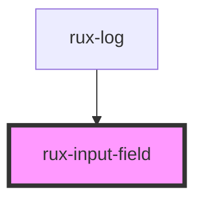

# rux-input

<!-- Auto Generated Below -->

## Properties

| Property      | Attribute     | Description                                                                                                                                                                             | Type                                                                        | Default     |
| ------------- | ------------- | --------------------------------------------------------------------------------------------------------------------------------------------------------------------------------------- | --------------------------------------------------------------------------- | ----------- |
| `disabled`    | `disabled`    | Disables the button via HTML disabled attribute. Button takes on a distinct visual state. Cursor uses the not-allowed system replacement and all keyboard and mouse events are ignored. | `boolean`                                                                   | `false`     |
| `errorText`   | `error-text`  | The validation error text                                                                                                                                                               | `string \| undefined`                                                       | `undefined` |
| `helpText`    | `help-text`   | The help or explanation text                                                                                                                                                            | `string \| undefined`                                                       | `undefined` |
| `invalid`     | `invalid`     | Marks the input as invalid                                                                                                                                                              | `boolean`                                                                   | `false`     |
| `label`       | `label`       | The input label text                                                                                                                                                                    | `string \| undefined`                                                       | `undefined` |
| `max`         | `max`         | The input max attribute                                                                                                                                                                 | `string \| undefined`                                                       | `undefined` |
| `min`         | `min`         | The input min attribute                                                                                                                                                                 | `string \| undefined`                                                       | `undefined` |
| `name`        | `name`        | The input name                                                                                                                                                                          | `string`                                                                    | `''`        |
| `placeholder` | `placeholder` | The input placeholder text                                                                                                                                                              | `string \| undefined`                                                       | `undefined` |
| `required`    | `required`    | Sets the input as disabled                                                                                                                                                              | `boolean`                                                                   | `false`     |
| `small`       | `small`       | Styles the input element and label smaller for space-limited situations.                                                                                                                | `boolean`                                                                   | `false`     |
| `step`        | `step`        | The input step attribute                                                                                                                                                                | `string \| undefined`                                                       | `undefined` |
| `type`        | `type`        | The input type                                                                                                                                                                          | `"email" \| "number" \| "password" \| "search" \| "tel" \| "text" \| "url"` | `'text'`    |
| `value`       | `value`       | The input value                                                                                                                                                                         | `string`                                                                    | `''`        |

## Events

| Event        | Description                                                                                                                                                                    | Type               |
| ------------ | ------------------------------------------------------------------------------------------------------------------------------------------------------------------------------ | ------------------ |
| `rux-change` | Fired when the value of the input changes - [HTMLElement/input_event](https://developer.mozilla.org/en-US/docs/Web/API/HTMLElement/input_event)                                | `CustomEvent<any>` |
| `rux-input`  | Fired when an alteration to the input's value is committed by the user - [HTMLElement/change_event](https://developer.mozilla.org/en-US/docs/Web/API/HTMLElement/change_event) | `CustomEvent<any>` |

## CSS Custom Properties

| Name                              | Description                              |
| --------------------------------- | ---------------------------------------- |
| `--inputBackgroundColor`          | the input background color               |
| `--inputBorderColor`              | the input border color                   |
| `--inputFocusBorderColor`         | the input focus border color             |
| `--inputFocusTextColor`           | the input focus text color               |
| `--inputInvalidBorderColor`       | the input invalid border color           |
| `--inputSearchCancel`             | the input search cancel                  |
| `--inputSearchIcon`               | the input search icon                    |
| `--inputSelectionBackgroundColor` | the background color of highlighted text |
| `--inputTextColor`                | the input text color                     |

## Dependencies

### Used by

 - [rux-log](../rux-log)

### Graph

----------------------------------------------

*Built with [StencilJS](https://stenciljs.com/)*
