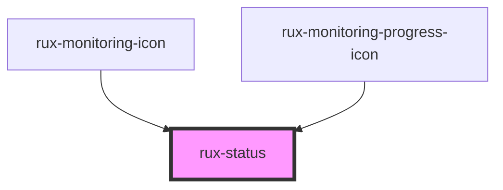

# rux-status

<!-- Auto Generated Below -->

## Properties

| Property | Attribute | Description | Type                                                                     | Default     |
| -------- | --------- | ----------- | ------------------------------------------------------------------------ | ----------- |
| `status` | `status`  |             | `"caution" \| "critical" \| "normal" \| "off" \| "serious" \| "standby"` | `undefined` |

## Dependencies

### Used by

-   [rux-monitoring-icon](../rux-monitoring-icon)
-   [rux-monitoring-progress-icon](../rux-monitoring-progress-icon)

### Graph

---

_Built with [StencilJS](https://stenciljs.com/)_
