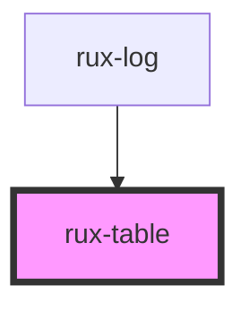

# rux-table

<!-- Auto Generated Below -->


## Usage

### Simple

```html
<rux-table>
    <rux-table-header>
        <rux-table-header-row>
            <rux-table-header-cell> Header 1 </rux-table-header-cell>
            <rux-table-header-cell> Header 2 </rux-table-header-cell>
        </rux-table-header-row>
    </rux-table-header>
    <rux-table-body>
        <rux-table-row>
            <rux-table-cell> Data </rux-table-cell>
            <rux-table-cell> Data </rux-table-cell>
        </rux-table-row>
    </rux-table-body>
</rux-table>
```


## CSS Custom Properties

| Name                                   | Description                            |
| -------------------------------------- | -------------------------------------- |
| `--tableBorderColor`                   | Table background color                 |
| `--tableControlsBackgroundColor`       | Table controls background color        |
| `--tableFilterBorderColor`             | Table filter border color              |
| `--tableFilterDisabledBackgroundColor` | Table filter disabled background color |
| `--tableFilterDisabledBorderColor`     | Table filter disabled border color     |
| `--tableHeaderAccentColor`             | Table header accent color              |
| `--tableHeaderBackgroundColor`         | Table header background color          |
| `--tableHeaderBorderColor`             | Table header border color              |
| `--tableHeaderBoxShadow`               | Table header box shadow                |
| `--tableHeaderTextColor`               | Table header text color                |
| `--tableRowBackgroundColor`            | Table row background color             |
| `--tableRowBorderColor`                | Table row border color                 |
| `--tableRowHoverBackgroundColor`       | Table row hover background color       |
| `--tableRowHoverTextColor`             | Table row hover text color             |
| `--tableRowSelectedBackgroundColor`    | Table row selected background color    |
| `--tableRowSelectedBorderColor`        | Table row selected border color        |
| `--tableRowTextColor`                  | Table row text color                   |


## Dependencies

### Used by

 - [rux-log](../rux-log)

### Graph


----------------------------------------------

*Built with [StencilJS](https://stenciljs.com/)*
