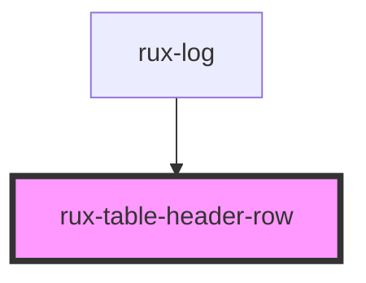

# rux-table-header-row

<!-- Auto Generated Below -->

## Dependencies

### Used by

 - [rux-log](../../rux-log)

### Graph

----------------------------------------------

*Built with [StencilJS](https://stenciljs.com/)*
