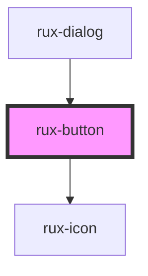

# Buttons

Buttons allow users to trigger actions.

## Guidelines

-   [Astro UXDS: Buttons](http://www.astrouxds.com/ui-components/buttons)

## Web Components Usage

### 2. Render the Astro Button Web Component

Pass properties as attributes of the Astro Button custom element:

```xml
<rux-button size="large" disabled secondary>
  Large disabled secondary button
</rux-button>
```

The component auto-imports the default Astro Icon Web Component for icons, if you specify one:

```xml
<rux-button icon="settings">
  Button with icon using astro UXDS icon web component
</rux-button>
```

Also, you can use [Slots](https://developer.mozilla.org/en-US/docs/Web/Web_Components/Using_templates_and_slots#Adding_flexibility_with_slots) to define icons within buttons. This method is best if you need to override the default icon library SVG file:

```xml
  <rux-button>
    <rux-icon icon="custom" library="/icons/custom.svg" viewBox="0 0 128 128"></rux-icon>
    Slotted icon button
  </rux-button>
```

In this situation, you do not need to specify a size for the icon component -- the button's size attribute will define the appropriate size of the icon.

## Basic HTML Usage

### 1. Include the Astro UXDS CSS file

Latest release is available in the [static css directory](https://github.com/RocketCommunicationsInc/astro-components/tree/master/static/css).

```xml
<link rel="stylesheet" href="/your-project/path/astro.css" />
```

### 2. Markup the component using HTML and the Astro CSS classes

Astro CSS classes follow the [BEM-style](http://getbem.com/introduction/) naming convention.

Configure the component using native HTML attributes or [BEM-style](http://getbem.com/introduction/) class suffixes after `rux-button--`.

```xml
<button class="rux-button">Submit</button>

<button class="rux-button rux-button--large rux-button--secondary" disabled>
  Large disabled secondary button
</button>
```

The basic HTML/CSS usage supports icons if using Web Components (and importing the Astro Icon Component):

```xml
<button class="rux-button rux-button--icon">
  <rux-icon class="rux-icon rux-button__icon" icon="settings" color="white"></rux-icon>
  Button with icon using astro UXDS icon web component
</button>
```

Otherwise, wrap your icon SVG in an HTML element with the [BEM-style](http://getbem.com/introduction/) classes `"rux-icon rux-button__icon"`:

```xml
<button class="rux-button rux-button--icon">
  <div class="rux-icon rux-button__icon">
    <svg ... ></svg>
  </div>
  Button with local icon
</button>
```

For more information about AstroUXDS usage outside of a Web Component environment, please see [Astro UXDS Stylesheets](https://www.astrouxds.com/components/readme/#getting-started-with-html-%26-css)

---

## Revision History

##### **4.1**

-   Add styles for and example of using slots for Icon child component

##### **4.0**

-   Swapped kebab-cased `icon-only` attribute for standard camelCase `iconOnly`
-   Deprecated `type` attribute in favor of separate `size`, `iconOnly`, and `secondary` attributes. `default` type is No longer supported.
-   Fixed the width of the small icon-only button and ensured icon-only buttons show No text, even if text is provided
-   Fixed secondary button icon color
-   Re-enabled missing focus styles on buttons.
-   Removed undocumented critical button style.
-   Replaced [Polymer 3](https://www.polymer-project.org) implementation with [LitElement](https://lit-element.polymer-project.org/) for improved speed and interoperability with JS Frameworks as well as simpler template declaration now available in vanilla JavaScript.

##### **3.0**

-   Removed Master Off Button Style
-   Replaced various properties with css custom properties to support
-   Removed `.satcom` class definition
-   Removed `narrow`/`short` definitions

##### **1.4**

-   Added `rux_` prefixes and BEM-compatible classes to all `satcom_`-prefixed elements. NOTE: `satcom_` will be removed in a future version
-   Disabled user selection of text on all buttons
-   Removed redundant background hover from `disabled` state by using `:not()` on the `:hover` state
-   Removed redundant background hover from `master off` by using `:not()` on the `:hover` state // deprecate after 1.4
-   Fixed Firefox alignment issue where text was misaligned vertically
-   Renamed `half-height` to `short` and `half-width` to `narrow` (Note: `rux_` only, `satcom_` retains old syntax)
-   Removed `user-select` and placed it in astro.css to apply to all input types
-   Embedded master off icon and removed the additional states required to handle icons and gradient backgrounds

<!-- Auto Generated Below -->


## Properties

| Property     | Attribute    | Description                                                                                                                                                                                                                                                                                                   | Type                                          | Default     |
| ------------ | ------------ | ------------------------------------------------------------------------------------------------------------------------------------------------------------------------------------------------------------------------------------------------------------------------------------------------------------- | --------------------------------------------- | ----------- |
| `borderless` | `borderless` | Changes button style from solid to borderless by setting the rux-button--borderless class                                                                                                                                                                                                                     | `boolean`                                     | `false`     |
| `disabled`   | `disabled`   | Toggles disabled attribute on the button                                                                                                                                                                                                                                                                      | `boolean`                                     | `false`     |
| `icon`       | `icon`       | For a [button style guide, see the Button section in Astro UXDS Guidelines](https://astrouxds.com/components/button) Displays an Astro icon matching this string. For a [full list of available icons, see the Icons section in Astro UXDS Guidelines](https://astrouxds.com/ui-components/icons-and-symbols) | `string \| undefined`                         | `undefined` |
| `iconOnly`   | `icon-only`  | Hides slotted text from the button by setting rux-button--icon-only class                                                                                                                                                                                                                                     | `boolean`                                     | `false`     |
| `secondary`  | `secondary`  | Changes button style from solid to secondary by setting the rux-button--secondary class                                                                                                                                                                                                                       | `boolean`                                     | `false`     |
| `size`       | `size`       | Changes size of a button from medium to small or large by setting sizing classes rux-button--small rux-button--large                                                                                                                                                                                          | `"large" \| "medium" \| "small" \| undefined` | `undefined` |
| `type`       | `type`       | The button type. Use 'submit' to submit native form data.                                                                                                                                                                                                                                                     | `"button" \| "submit"`                        | `'button'`  |


## Shadow Parts

| Part          | Description                           |
| ------------- | ------------------------------------- |
| `"container"` | the components native button element. |
| `"icon"`      | the optional rux-icon                 |


## Dependencies

### Used by

 - [rux-dialog](../rux-dialog)

### Depends on

- [rux-icon](../rux-icon)

### Graph


----------------------------------------------

*Built with [StencilJS](https://stenciljs.com/)*
