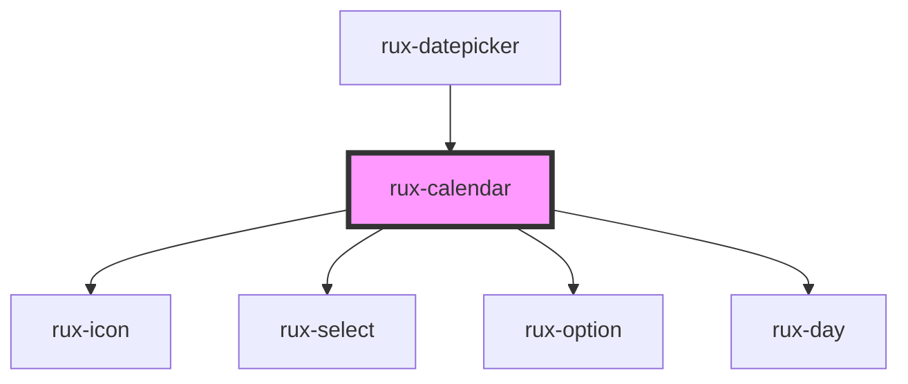

# rux-calendar

<!-- Auto Generated Below -->

## Properties

| Property | Attribute | Description                                      | Type                  | Default     |
| -------- | --------- | ------------------------------------------------ | --------------------- | ----------- |
| `dateIn` | `date-in` | Option to give the calendar a specfic month/year | `string \| undefined` | `undefined` |

## Dependencies

### Used by

 - [rux-datepicker](../rux-datepicker)

### Depends on

- [rux-icon](../rux-icon)
- [rux-select](../rux-select)
- [rux-option](../rux-option)
- [rux-day](rux-day)

### Graph

----------------------------------------------

*Built with [StencilJS](https://stenciljs.com/)*
