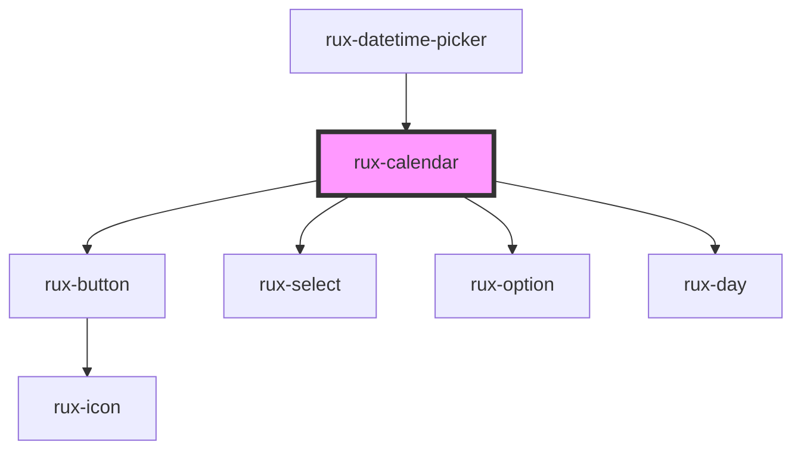

# rux-calendar

<!-- Auto Generated Below -->

## Properties

| Property    | Attribute   | Description | Type                     | Default |
| ----------- | ----------- | ----------- | ------------------------ | ------- |
| `iso`       | `iso`       |             | `string`                 | `''`    |
| `maxYear`   | `max-year`  |             | `number`                 | `2100`  |
| `minYear`   | `min-year`  |             | `number`                 | `1900`  |
| `precision` | `precision` |             | `"min" \| "ms" \| "sec"` | `'min'` |

## Dependencies

### Used by

 - [rux-datetime-picker](../rux-datetime-picker)

### Depends on

- [rux-button](../rux-button)
- [rux-select](../rux-select)
- [rux-option](../rux-option)
- [rux-day](rux-day)

### Graph

----------------------------------------------

*Built with [StencilJS](https://stenciljs.com/)*
