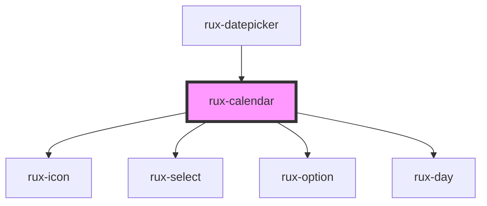

# rux-calendar

<!-- Auto Generated Below -->

## Properties

| Property | Attribute | Description                                                             | Type                            | Default     |
| -------- | --------- | ----------------------------------------------------------------------- | ------------------------------- | ----------- |
| `dateIn` | `date-in` | Option to give the calendar a specfic month/year                        | `number \| string \| undefined` | `undefined` |
| `max`    | `max`     | Max date that the calendar will go to. Needs to be a valid date string. | `string \| undefined`           | `undefined` |
| `min`    | `min`     | Min date that the calendar will go to. Needs to be a valid date string. | `string \| undefined`           | `undefined` |
| `value`  | `value`   | Contains the currently selected date as an ISO string.                  | `string \| undefined`           | `undefined` |

## Events

| Event             | Description                                                                                   | Type                  |
| ----------------- | --------------------------------------------------------------------------------------------- | --------------------- |
| `ruxdateselected` | Emitted when a date is selected using the calendar. Emits the selected date as an ISO string. | `CustomEvent<string>` |

## Slots

| Slot       | Description     |
| ---------- | --------------- |
| `"footer"` | the footer slot |
| `"header"` | the header slot |

## Shadow Parts

| Part                 | Description                                                                |
| -------------------- | -------------------------------------------------------------------------- |
| `"body"`             | the body of the rux-calendar which contains all days.                      |
| `"footer"`           | the footer of the rux-calendar                                             |
| `"header"`           | the header of rux-calendar which contains the select menus and arrow icons |
| `"left-arrow-icon"`  | the left arrow rux-icon that moves months backward                         |
| `"month-picker"`     | the rux-select that controls the month                                     |
| `"right-arrow-icon"` | the right arrow rux-icon that moves months forward                         |
| `"year-picker"`      | the rux-select that controls the year                                      |

## Dependencies

### Used by

 - [rux-datepicker](../rux-datepicker)

### Depends on

- [rux-icon](../rux-icon)
- [rux-select](../rux-select)
- [rux-option](../rux-option)
- [rux-day](rux-day)

### Graph

----------------------------------------------

*Built with [StencilJS](https://stenciljs.com/)*
