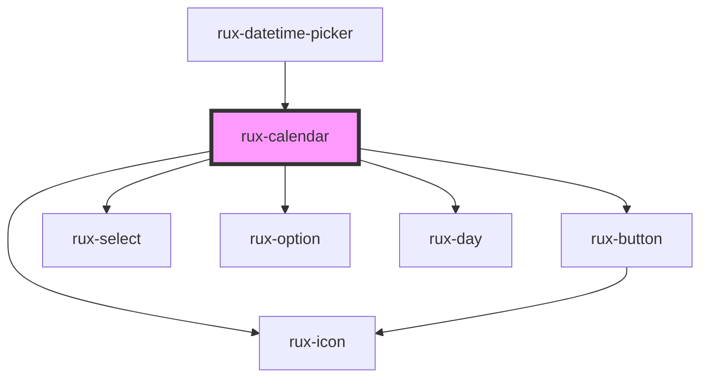

# rux-calendar

<!-- Auto Generated Below -->

## Properties

| Property                | Attribute                 | Description                                                                                                                                                         | Type                     | Default |
| ----------------------- | ------------------------- | ------------------------------------------------------------------------------------------------------------------------------------------------------------------- | ------------------------ | ------- |
| `incomingDay`           | `incoming-day`            |                                                                                                                                                                     | `string`                 | `''`    |
| `incomingMonth`         | `incoming-month`          |                                                                                                                                                                     | `string`                 | `''`    |
| `incomingYear`          | `incoming-year`           |                                                                                                                                                                     | `string`                 | `''`    |
| `initHoursValue`        | `init-hours-value`        |                                                                                                                                                                     | `string`                 | `''`    |
| `initMillisecondsValue` | `init-milliseconds-value` |                                                                                                                                                                     | `string`                 | `''`    |
| `initMinutesValue`      | `init-minutes-value`      |                                                                                                                                                                     | `string`                 | `''`    |
| `initSecondsValue`      | `init-seconds-value`      |                                                                                                                                                                     | `string`                 | `''`    |
| `isJulian`              | `is-julian`               |                                                                                                                                                                     | `boolean`                | `false` |
| `iso`                   | `iso`                     |                                                                                                                                                                     | `string`                 | `''`    |
| `maxYear`               | `max-year`                |                                                                                                                                                                     | `number`                 | `2100`  |
| `minYear`               | `min-year`                |                                                                                                                                                                     | `number`                 | `1900`  |
| `precision`             | `precision`               | Determines the precision of the time picker down to milliseconds. When the calendar is within a rux-datepicker, the precision is set from the datepicker component. | `"min" \| "ms" \| "sec"` | `'min'` |

## Events

| Event                        | Description | Type                            |
| ---------------------------- | ----------- | ------------------------------- |
| `datetimeupdated`            |             | `CustomEvent<{ iso: string; }>` |
| `ruxcalendardatetimeupdated` |             | `CustomEvent<{ iso: string; }>` |

## Dependencies

### Used by

 - [rux-datetime-picker](../rux-datetime-picker)

### Depends on

- [rux-button](../rux-button)
- [rux-select](../rux-select)
- [rux-option](../rux-option)
- [rux-day](rux-day)
- [rux-icon](../rux-icon)

### Graph

----------------------------------------------

*Built with [StencilJS](https://stenciljs.com/)*
