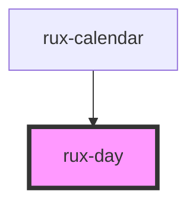

# rux-day

<!-- Auto Generated Below -->

## Properties

| Property   | Attribute  | Description                             | Type      | Default |
| ---------- | ---------- | --------------------------------------- | --------- | ------- |
| `selected` | `selected` | Determines if a day is selected or not. | `boolean` | `false` |

## Events

| Event            | Description                                                         | Type                             |
| ---------------- | ------------------------------------------------------------------- | -------------------------------- |
| `ruxdayselected` | Emitted when a rux-day becomes selected. Emits the rux-day element. | `CustomEvent<HTMLRuxDayElement>` |

## Slots

| Slot          | Description                               |
| ------------- | ----------------------------------------- |
| `"julian"`    | displays the Julian (oridnal) day         |
| `"today-dot"` | the blue dot that denotes the current day |

## Shadow Parts

| Part       | Description                          |
| ---------- | ------------------------------------ |
| `"button"` | The encapsulating button on rux-day. |

## Dependencies

### Used by

 - [rux-calendar](..)

### Graph

----------------------------------------------

*Built with [StencilJS](https://stenciljs.com/)*
