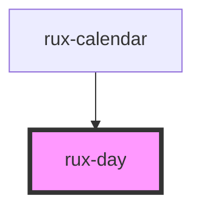

# rux-day

<!-- Auto Generated Below -->

## Properties

| Property    | Attribute    | Description | Type      | Default |
| ----------- | ------------ | ----------- | --------- | ------- |
| `dayNumber` | `day-number` |             | `string`  | `''`    |
| `selected`  | `selected`   |             | `boolean` | `false` |

## Events

| Event            | Description | Type                                                                                                        |
| ---------------- | ----------- | ----------------------------------------------------------------------------------------------------------- |
| `ruxdayselected` |             | `CustomEvent<{ dayNumber: string; isPastDay: boolean; isFutureDay: boolean; element: HTMLRuxDayElement; }>` |

## Dependencies

### Used by

 - [rux-calendar](..)

### Graph

----------------------------------------------

*Built with [StencilJS](https://stenciljs.com/)*
