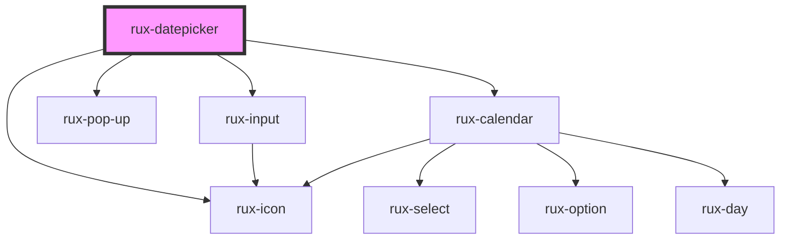

# rux-datepicker

<!-- Auto Generated Below -->

## Properties

| Property | Attribute | Description | Type      | Default |
| -------- | --------- | ----------- | --------- | ------- |
| `open`   | `open`    |             | `boolean` | `false` |

## Events

| Event          | Description                                       | Type               |
| -------------- | ------------------------------------------------- | ------------------ |
| `ruxcollapsed` | Emitted when the datepicker's calendar is closed. | `CustomEvent<any>` |
| `ruxexpanded`  | Emitted when the datepickers calendar is opened.  | `CustomEvent<any>` |

## Dependencies

### Depends on

- [rux-input](../rux-input)
- [rux-pop-up](../rux-pop-up)
- [rux-icon](../rux-icon)
- [rux-calendar](../rux-calendar)

### Graph

----------------------------------------------

*Built with [StencilJS](https://stenciljs.com/)*
