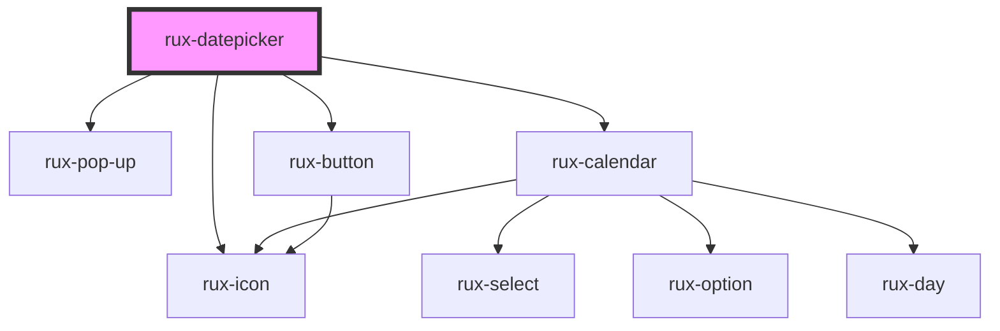

# rux-datepicker

<!-- Auto Generated Below -->

## Properties

| Property   | Attribute  | Description | Type                  | Default     |
| ---------- | ---------- | ----------- | --------------------- | ----------- |
| `julian`   | `julian`   |             | `boolean`             | `false`     |
| `max`      | `max`      |             | `number \| undefined` | `undefined` |
| `min`      | `min`      |             | `number \| undefined` | `undefined` |
| `open`     | `open`     |             | `boolean`             | `false`     |
| `standard` | `standard` |             | `boolean`             | `true`      |

## Events

| Event          | Description | Type               |
| -------------- | ----------- | ------------------ |
| `ruxcollapsed` |             | `CustomEvent<any>` |
| `ruxexpanded`  |             | `CustomEvent<any>` |

## Dependencies

### Depends on

- [rux-pop-up](../rux-pop-up)
- [rux-icon](../rux-icon)
- [rux-calendar](../rux-calendar)
- [rux-button](../rux-button)

### Graph

----------------------------------------------

*Built with [StencilJS](https://stenciljs.com/)*
