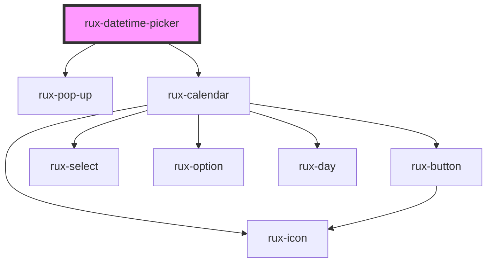

# rux-datetime-picker

<!-- Auto Generated Below -->

## Properties

| Property       | Attribute       | Description | Type                             | Default     |
| -------------- | --------------- | ----------- | -------------------------------- | ----------- |
| `disabled`     | `disabled`      |             | `boolean`                        | `false`     |
| `errorText`    | `error-text`    |             | `string \| undefined`            | `undefined` |
| `helpText`     | `help-text`     |             | `string \| undefined`            | `undefined` |
| `invalid`      | `invalid`       |             | `boolean`                        | `false`     |
| `julianFormat` | `julian-format` |             | `boolean`                        | `false`     |
| `label`        | `label`         |             | `string \| undefined`            | `undefined` |
| `maxYear`      | `max-year`      |             | `number`                         | `2100`      |
| `minYear`      | `min-year`      |             | `number`                         | `1900`      |
| `name`         | `name`          |             | `string \| undefined`            | `undefined` |
| `precision`    | `precision`     |             | `"min" \| "ms" \| "sec"`         | `'min'`     |
| `required`     | `required`      |             | `boolean`                        | `false`     |
| `size`         | `size`          |             | `"large" \| "medium" \| "small"` | `'medium'`  |
| `value`        | `value`         |             | `string \| undefined`            | `undefined` |

## Dependencies

### Depends on

- [rux-pop-up](../rux-pop-up)
- [rux-calendar](../rux-calendar)

### Graph

----------------------------------------------

*Built with [StencilJS](https://stenciljs.com/)*
