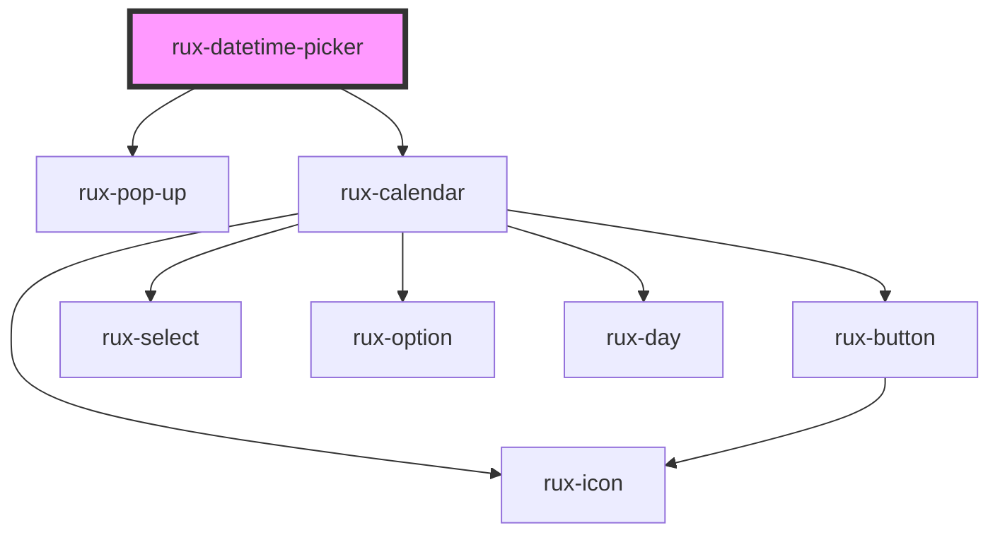

# rux-datetime-picker

<!-- Auto Generated Below -->

## Properties

| Property       | Attribute       | Description                                                                                                                                                                                               | Type                                        | Default     |
| -------------- | --------------- | --------------------------------------------------------------------------------------------------------------------------------------------------------------------------------------------------------- | ------------------------------------------- | ----------- |
| `disabled`     | `disabled`      | Disables the datetime-picker via HTML disabled attribute. Datetime-picker takes on a distinct visual state. Cursor uses the not-allowed system replacement and all keyboard and mouse events are ignored. | `boolean`                                   | `false`     |
| `errorText`    | `error-text`    | The validation error text                                                                                                                                                                                 | `string \| undefined`                       | `undefined` |
| `helpText`     | `help-text`     | The help or explanation text                                                                                                                                                                              | `string \| undefined`                       | `undefined` |
| `invalid`      | `invalid`       | Presentational only. Renders the Input Field as invalid                                                                                                                                                   | `boolean`                                   | `false`     |
| `julianFormat` | `julian-format` | Controls whether the datetime-picker should be used in Julian format, ie YYYY-DDDThh:mm:ss.SSSZ                                                                                                           | `boolean`                                   | `false`     |
| `label`        | `label`         | The datetime-picker label text                                                                                                                                                                            | `string \| undefined`                       | `undefined` |
| `maxYear`      | `max-year`      | Sets the maximum year the datetime-picker can use                                                                                                                                                         | `number`                                    | `2100`      |
| `minYear`      | `min-year`      | Sets the minimum year the datetime-picker can use                                                                                                                                                         | `number`                                    | `1900`      |
| `name`         | `name`          | The datetime-picker name                                                                                                                                                                                  | `string`                                    | `''`        |
| `precision`    | `precision`     | Controls the precision to which the time is displayed on the datetime-picker                                                                                                                              | `"day" \| "hour" \| "min" \| "ms" \| "sec"` | `'ms'`      |
| `required`     | `required`      | Presentational only. Sets the datetime-picker as required                                                                                                                                                 | `boolean`                                   | `false`     |
| `size`         | `size`          | Control the padding around the input field                                                                                                                                                                | `"large" \| "medium" \| "small"`            | `'medium'`  |
| `value`        | `value`         | The value of the datetime-picker                                                                                                                                                                          | `string`                                    | `''`        |

## Events

| Event       | Description                                                                      | Type               |
| ----------- | -------------------------------------------------------------------------------- | ------------------ |
| `ruxblur`   | Fired when the datetime-picker loses focus                                       | `CustomEvent<any>` |
| `ruxchange` | Fired when the value of the datetime-picker changes and is committed by the user | `CustomEvent<any>` |
| `ruxinput`  | Fired when the value of the datetime-picker changes                              | `CustomEvent<any>` |

## Shadow Parts

| Part         | Description |
| ------------ | ----------- |
| `"required"` |             |

## Dependencies

### Depends on

- [rux-pop-up](../rux-pop-up)
- [rux-calendar](../rux-calendar)

### Graph

----------------------------------------------

*Built with [StencilJS](https://stenciljs.com/)*
