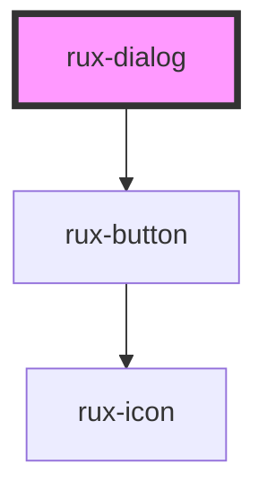

# rux-dialog

A Rux dialog interrupts the app experience to prompt a user to confirm an action or acknowledge a piece of information. It displays information along with a set of buttons allowing users to “Accept or Cancel” the actions presented within the Rux dialog.

## Guidelines

-   [Astro UXDS: Dialog](https://astrouxds.com/ui-components/dialog)

## Web Components Usage

### 1. Installation

#### Download the [Astro UXDS Component Library](https://github.com/RocketCommunicationsInc/astro-components) source to your project.

Via CLI:

```sh
git clone https://github.com/RocketCommunicationsInc/astro-components.git
```

Or, [download the Astro UXDS Components as a .zip](https://github.com/RocketCommunicationsInc/astro-components/archive/master.zip)

### 2. Import the Astro Rux Dialog Web Component

This example assumes you're using the NPM package in `node_modules`. Otherwise, import the component using the path to the Astro Components directory in your project.

```javascript
import { RuxDialog } from '@astrouxds/rux-dialog/rux-dialog.js'
```

### 3. Render the Astro Rux Dialog Web Component

Pass properties as attributes of the Astro Rux Dialog custom element:

```xml
<rux-dialog
  title="dialog title"
  message="dialog message"
  confirmText="Ok"
  denyText="Cancel"
  customEvent="listen-for-me">
</rux-dialog>
```

Or use slots to render the header, content and footer.

```xml
<rux-dialog>
  <span slot="header">Slot Header</span>
  <p>Dialog Content as a slot</p>
  <div slot="footer">
    <rux-button secondary>Cancel</rux-button>
    <rux-button>Confrim</rux-button>
  </div>
</rux-dialog>
```

<!-- Auto Generated Below -->


## Properties

| Property       | Attribute        | Description                                 | Type                  | Default     |
| -------------- | ---------------- | ------------------------------------------- | --------------------- | ----------- |
| `clickToClose` | `click-to-close` | Allows dialog to close when clicking off it | `boolean`             | `false`     |
| `confirmText`  | `confirm-text`   | Text for confirmation button                | `string`              | `'Confirm'` |
| `denyText`     | `deny-text`      | Text for close button                       | `string`              | `'Cancel'`  |
| `header`       | `header`         | Dialog header title                         | `string \| undefined` | `undefined` |
| `message`      | `message`        | Dialog body message                         | `string \| undefined` | `undefined` |
| `open`         | `open`           | Shows and hides dialog                      | `boolean`             | `false`     |


## Events

| Event             | Description                                                                                                                                                                                                            | Type                           |
| ----------------- | ---------------------------------------------------------------------------------------------------------------------------------------------------------------------------------------------------------------------- | ------------------------------ |
| `ruxdialogclosed` | Event that is fired when dialog closes. If dialog is closed by clicking on the default confirm or deny buttons (when no footer slot is provided), then true or false will be emitted respectively on the event.detail. | `CustomEvent<boolean \| null>` |
| `ruxdialogopened` | Event that is fired when dialog opens                                                                                                                                                                                  | `CustomEvent<void>`            |


## Methods

### `hide() => Promise<void>`

Closes the dialog

#### Returns

Type: `Promise<void>`


### `show() => Promise<void>`

Opens the dialog

#### Returns

Type: `Promise<void>`


### `toggle() => Promise<void>`

Toggles the dialog's open prop.

#### Returns

Type: `Promise<void>`


## Slots

| Slot          | Description                     |
| ------------- | ------------------------------- |
| `"(default)"` | the dialog's message or content |
| `"footer"`    | the footer of the dialog        |
| `"header"`    | the header of the dialog        |


## Shadow Parts

| Part               | Description                 |
| ------------------ | --------------------------- |
| `"confirm-button"` | the dialog's confirm button |
| `"container"`      | the dialog container        |
| `"deny-button"`    | the dialog's deny button    |
| `"dialog"`         | the native dialog element   |
| `"footer"`         | the footer of the dialog    |
| `"header"`         | the header of the dialog    |
| `"message"`        | the message of the dialog   |


## Dependencies

### Depends on

- [rux-button](../rux-button)

### Graph


----------------------------------------------

*Built with [StencilJS](https://stenciljs.com/)*
