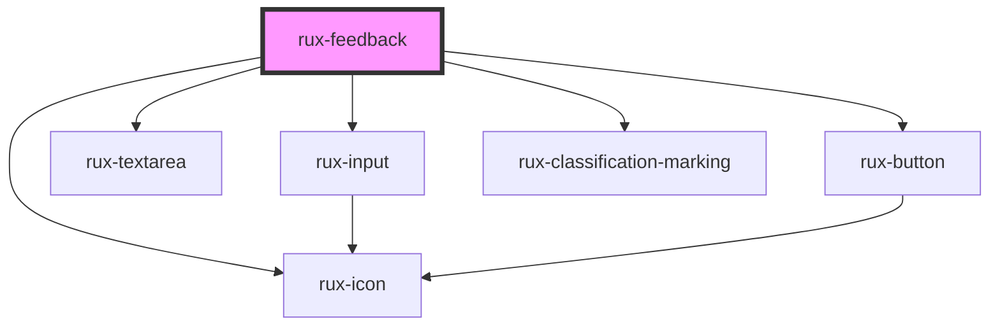

# rux-feedback

<!-- Auto Generated Below -->

## Properties

| Property         | Attribute        | Description | Type                                                                                                                     | Default     |
| ---------------- | ---------------- | ----------- | ------------------------------------------------------------------------------------------------------------------------ | ----------- |
| `classification` | `classification` |             | `"confidential" \| "controlled" \| "cui" \| "secret" \| "top-secret" \| "top-secret-sci" \| "unclassified" \| undefined` | `undefined` |

## Events

| Event                | Description | Type                            |
| -------------------- | ----------- | ------------------------------- |
| `feedback-submitted` |             | `CustomEvent<FeedbackFormData>` |

## Shadow Parts

| Part                | Description |
| ------------------- | ----------- |
| `"bug"`             |             |
| `"container"`       |             |
| `"form"`            |             |
| `"header"`          |             |
| `"idea"`            |             |
| `"issue"`           |             |
| `"other"`           |             |
| `"sentiment-group"` |             |
| `"success"`         |             |
| `"tab"`             |             |
| `"title"`           |             |
| `"topic-selector"`  |             |

## Dependencies

### Depends on

- [rux-icon](../rux-icon)
- [rux-input](../rux-input)
- [rux-textarea](../rux-textarea)
- [rux-button](../rux-button)
- [rux-classification-marking](../rux-classification-marking)

### Graph

----------------------------------------------

*Built with [StencilJS](https://stenciljs.com/)*
