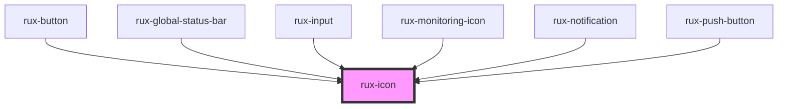

# rux-icon# Icons

Display icons used in the Astro Design System

## Guidelines

-   [Astro UXDS: Icons and Symbols](https://astrouxds.com/ui-components/icons-and-symbols)

## Installation

`npm i -save @astrouxds/rux-icon`

## Web Components Usage

### 1. Installation

#### Install the Astro UXDS Icon package via Command Line (Preferred Method)

```sh
npm i --save @astrouxds/rux-icon
```

You may use Yarn, NPM, or your Node package manager of choice. The `--save` flag adds this component as a dependency in your `package.json` file.

#### **Alternatively**, download the [Astro Component Library](https://github.com/RocketCommunicationsInc/astro-components) source to your project.

Via CLI:

```sh
git clone https://github.com/RocketCommunicationsInc/astro-components.git
```

Or, [download the Astro UXDS Components as a .zip](https://github.com/RocketCommunicationsInc/astro-components/archive/master.zip)

### 2. Import the Astro Icon Web Component

This example assumes you're using the NPM package in `node_modules`. Otherwise, import the component using the path to the Astro Components directory in your project.

```javascript
import { RuxIcon } from '@astrouxds/rux-icon/rux-icon.js'
```

### 3. Render the Astro Icon Web Component

Pass properties as attributes of the Astro Icon custom element:

```xml
<rux-icon icon="altitude" label="Altitude" color="#fff" ></rux-icon>
```

### Properties

| Property | Type   | Default     | Required | Description                                                                                                                                                                                                     |
| -------- | ------ | ----------- | -------- | --------------------------------------------------------------------------------------------------------------------------------------------------------------------------------------------------------------- |
| `icon`   | String | `''`        | Yes      | Displays an icon matching this string. For a [full list of available icons in the Astro default library, see the Icons section in Astro UXDS Guidelines](https://astrouxds.com/ui-components/icons-and-symbols) |
| `label`  | String | `''`        | Yes      | A descriptive label of the icon.                                                                                                                                                                                |
| `color`  | String | `'#4dacff'` | No       | Applies a custom fill color as a valid HTML color string, e.g., hexadecimal, RGBA or HSL value.                                                                                                                 |
| `size`   | String | `'normal'`  | No       | Adjusts icon size, supported values are `extra-small` (16px), `small` (32px), `normal` (48px) and `large` (64px)                                                                                                |

#### **Custom icons**

Access an external (non-Astro) icon library via the `library` attribute, which requires a root-relative path to an SVG file where the component's `icon` string attribute matches an element's `id`.

```xml
<rux-icon library="/icons/my-custom-icons.svg" icon="my-icon"></rux-icon>
```

In the SVG icon library file:

```svg
<svg>
	<defs>
		<g id="my-icon">...

```

## Revision History

##### **4.0**

-   Removed the `namespace:icon` pattern in favor of supporting multiple libraries, both default (Astro) and external, adding the `library` property (see [Astro 4 migration note](#astro-4-migration) below)
-   Replaced the DOM manipulation library for loading icons in favor of an HTML5 template TODO: add support for template outside of WebComponents when browser’s support shadowDOM piercing
-   Moved Astro Status Icons to their own package, `rux-status`
-   Replaced [Polymer 3](https://www.polymer-project.org) implementation with [LitElement](https://lit-element.polymer-project.org/) for improved speed and interoperability with JS Frameworks as well as simpler template declaration now available in vanilla JavaScript.
-   Extended icon set with Google Material Design icons. License: https://github.com/google/material-design-icons/blob/master/LICENSE

<a name="astro-4-migration">

## Important Astro 4 Migration Note:

Prior to Astro 4.0, the Astro UXDS Icon Component imported icons from a single SVG file where icons were identified by `id` under specific groups. In that method, icons were accessed via a namespaced value for the `icon` property, such as `"group-id:icon-id"`.

### Prior to Astro 4.0:

```xml
<rux-icon icon="default:settings"></rux-icon>

```

In Astro 4.0, these groups have been flattened, and each icon is now imported directly without any group prefix. If you would like to load another icon library SVG file, use the `library` property. You can easily namespace your own custom icons (e.g., `my-namespaced-prefix_settings`) and access those icons via the `icon` attribute.

### Astro 4.0 with default Astro icons:

```xml
<rux-icon icon="settings"></rux-icon>
```

### Astro 4.0 with custom icons:

```xml
<rux-icon library="/icons/my-namespaced-custom-icons.svg" icon="my-namespaced-prefix_settings"></rux-icon>
```

<!-- Auto Generated Below -->


## Properties

| Property            | Attribute | Description                                                                                                                    | Type                  | Default     |
| ------------------- | --------- | ------------------------------------------------------------------------------------------------------------------------------ | --------------------- | ----------- |
| `icon` _(required)_ | `icon`    | The icon name                                                                                                                  | `string`              | `undefined` |
| `label`             | `label`   | The icon SVG's title attribute. Used for accessibility. If none is provided, the icon name will be used.                       | `string \| undefined` | `undefined` |
| `size`              | `size`    | The size of the icon. Can be 'extra-small', 'small', 'normal', 'large', 'auto' or any custom value ('30px', '1rem', '3.321em') | `string`              | `'normal'`  |


## Shadow Parts

| Part     | Description          |
| -------- | -------------------- |
| `"icon"` | the icon in rux-icon |


## Dependencies

### Used by

 - [rux-button](../rux-button)
 - [rux-global-status-bar](../rux-global-status-bar)
 - [rux-input](../rux-input)
 - [rux-monitoring-icon](../rux-monitoring-icon)
 - [rux-notification](../rux-notification)
 - [rux-push-button](../rux-push-button)

### Graph


----------------------------------------------

*Built with [StencilJS](https://stenciljs.com/)*
