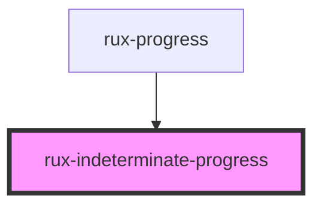

# rux-indeterminate-progress

<!-- Auto Generated Below -->

## Shadow Parts

| Part                  | Description                                                                                                                                    |
| --------------------- | ---------------------------------------------------------------------------------------------------------------------------------------------- |
| `"animated-spinner"`  | The second div in the heirarchy which is responsible for the spinning conic-gradient and the gap between the spinner and the wrapper's border. |
| `"inner-circle"`      | The fourth div in the heirarchy which controls the inner-most circle.                                                                          |
| `"inner-spinner-gap"` | The third div in the heirarchy which controls the gap between the animated-spinner and the inner-circle's border.                              |
| `"wrapper"`           | The outermost div encasing rux-indeterminate-progress which is responsible for the overall size and the outermost border.                      |

## Dependencies

### Used by

 - [rux-progress](../rux-progress)

### Graph

----------------------------------------------

*Built with [StencilJS](https://stenciljs.com/)*
