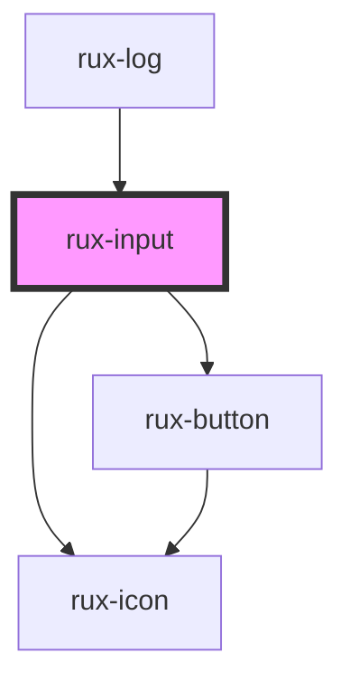

# rux-input

<!-- Auto Generated Below -->

## Properties

| Property       | Attribute      | Description                                                                                                                                                                             | Type                                                                                                      | Default     |
| -------------- | -------------- | --------------------------------------------------------------------------------------------------------------------------------------------------------------------------------------- | --------------------------------------------------------------------------------------------------------- | ----------- |
| `autocomplete` | `autocomplete` | The input's autocomplete attribute                                                                                                                                                      | `string \| undefined`                                                                                     | `undefined` |
| `disabled`     | `disabled`     | Disables the button via HTML disabled attribute. Button takes on a distinct visual state. Cursor uses the not-allowed system replacement and all keyboard and mouse events are ignored. | `boolean`                                                                                                 | `false`     |
| `errorText`    | `error-text`   | The validation error text                                                                                                                                                               | `string \| undefined`                                                                                     | `undefined` |
| `helpText`     | `help-text`    | The help or explanation text                                                                                                                                                            | `string \| undefined`                                                                                     | `undefined` |
| `invalid`      | `invalid`      | Presentational only. Renders the Input Field as invalid.                                                                                                                                | `boolean`                                                                                                 | `false`     |
| `label`        | `label`        | The input label text. For HTML content, use the `label` slot instead.                                                                                                                   | `string \| undefined`                                                                                     | `undefined` |
| `max`          | `max`          | The input max attribute                                                                                                                                                                 | `string \| undefined`                                                                                     | `undefined` |
| `min`          | `min`          | The input min attribute                                                                                                                                                                 | `string \| undefined`                                                                                     | `undefined` |
| `name`         | `name`         | The input name                                                                                                                                                                          | `string`                                                                                                  | `''`        |
| `placeholder`  | `placeholder`  | The input placeholder text                                                                                                                                                              | `string \| undefined`                                                                                     | `undefined` |
| `readonly`     | `readonly`     | The inputs readonly attribute                                                                                                                                                           | `boolean`                                                                                                 | `false`     |
| `required`     | `required`     | Sets the input as required                                                                                                                                                              | `boolean`                                                                                                 | `false`     |
| `size`         | `size`         | Control the padding around the input field                                                                                                                                              | `"large" \| "medium" \| "small"`                                                                          | `'medium'`  |
| `spellcheck`   | `spellcheck`   | The input's spellcheck attribute                                                                                                                                                        | `boolean`                                                                                                 | `false`     |
| `step`         | `step`         | The input step attribute                                                                                                                                                                | `string \| undefined`                                                                                     | `undefined` |
| `type`         | `type`         | The input type                                                                                                                                                                          | `"date" \| "datetime-local" \| "email" \| "number" \| "password" \| "search" \| "tel" \| "text" \| "url"` | `'text'`    |
| `value`        | `value`        | The input value                                                                                                                                                                         | `string`                                                                                                  | `''`        |

## Events

| Event       | Description                                                                                                                                                                    | Type               |
| ----------- | ------------------------------------------------------------------------------------------------------------------------------------------------------------------------------ | ------------------ |
| `ruxblur`   | Fired when an element has lost focus - [HTMLElement/blur_event](https://developer.mozilla.org/en-US/docs/Web/API/Element/blur_event)                                           | `CustomEvent<any>` |
| `ruxchange` | Fired when the value of the input changes - [HTMLElement/input_event](https://developer.mozilla.org/en-US/docs/Web/API/HTMLElement/input_event)                                | `CustomEvent<any>` |
| `ruxfocus`  | Fired when an element has gained focus - [HTMLElement/focus_event](https://developer.mozilla.org/en-US/docs/Web/API/Element/focus_event)                                       | `CustomEvent<any>` |
| `ruxinput`  | Fired when an alteration to the input's value is committed by the user - [HTMLElement/change_event](https://developer.mozilla.org/en-US/docs/Web/API/HTMLElement/change_event) | `CustomEvent<any>` |

## Slots

| Slot       | Description           |
| ---------- | --------------------- |
| `"label"`  | The input label       |
| `"prefix"` | Left side input icon  |
| `"suffix"` | Right side input icon |

## Shadow Parts

| Part           | Description                                         |
| -------------- | --------------------------------------------------- |
| `"error-text"` | The error text element                              |
| `"form-field"` | The form-field wrapper container                    |
| `"help-text"`  | The help text element                               |
| `"icon"`       | The icon displayed when toggle-password prop is set |
| `"input"`      | The input element                                   |
| `"label"`      | The input label when `label` prop is set            |
| `"prefix"`     | The container of the prefix slot                    |
| `"required"`   | The asterisk when required is true                  |
| `"suffix"`     | The container of the suffix slot                    |

## Dependencies

### Used by

 - [rux-log](../rux-log)

### Depends on

- [rux-button](../rux-button)
- [rux-icon](../rux-icon)

### Graph

----------------------------------------------

*Built with [StencilJS](https://stenciljs.com/)*
