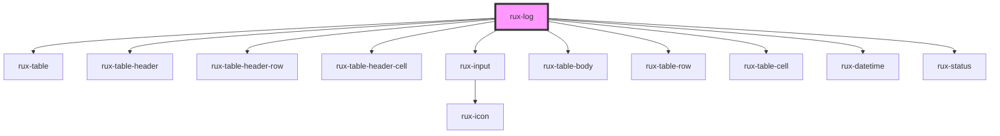

# RuxLog

A Log is a tabular representation of application events and may include username, priority, equipment type, signal type, etc. As part of the [Notification System](https://www.astrouxds.com/design-guidelines/notifications), Logs provide sorting and filtering function for examining events

## Guidelines

-   [Astro UXDS: Log](http://www.astrouxds.com/ui-components/log)
-   [Astro UXDS: Notification System](https://www.astrouxds.com/design-guidelines/notifications)

## Usage

RuxLog is a simple collection of other Astro components: Table, Status, Input, and a custom Notification bar. For an off-the-shelf solution, you can pass in a data array in the following format.

### Sample `data` Array

```js
;[
    {
        timestamp: new Date(1557503698781), // date from Unix Time Stamp number
        status: 'off',
        message: 'Antenna DGS 1 went offline.',
    },
    {
        timestamp: new Date('2019-05-10T16:21:12.000Z'), // date from ISO 8601 string format
        status: 'serious',
        message: 'USA-177 experienced solar panel misalignment.',
    },
    {
        timestamp: new Date(1557503698781),
        status: 'caution',
        message: 'USA-168 suffered power degradation.',
    },
    {
        timestamp: new Date(1557503698781),
        status: 'standby',
        message: 'Antenna DGS 2 has weak signal.',
    },
    {
        timestamp: new Date(1557503698781),
        status: 'off',
        message: 'Black FEP 121 is offline.',
    },
]
```

### Updating Data

When updating your array data, use non-mutable array operators (`map` and `filter`) instead of mutable operators (`push` and `unshift`)

#### Do

```html
<rux-log></rux-log>

const data = [ { timestamp: new Date(1557503698781), status: 'standby', message:
'Antenna DGS 2 has weak signal.', } ] const log =
document.querySelector('rux-log') log.data = data log.data = [ ...data, {
timestamp: new Date(), status: 'critical', event: 'my new event } ]
```

#### Don't

```html
<rux-log></rux-log>

const data = [ { timestamp: new Date(1557503698781), status: 'standby', message:
'Antenna DGS 2 has weak signal.', } ] const log =
document.querySelector('rux-log') log.data = data data.push( { timestamp: new
Date(), status: 'critical', event: 'my new event } ) log.data = data
```

### Advanced Customization

For more advanced customization, RuxLog exposes the entire table element and each individual table element as slots. When using your own table implementation, you will be responsible for handling the filtering on your own.

<!-- Auto Generated Below -->


## Overview

A Log is a tabular representation of application events and may include username, priority, equipment type, signal type, etc. As part of the [Notification System](https://www.astrouxds.com/design-guidelines/notifications), Logs provide sorting and filtering function for examining events.

## Properties

| Property   | Attribute  | Description                                                                                                                                                                                                                                                                                             | Type                  | Default     |
| ---------- | ---------- | ------------------------------------------------------------------------------------------------------------------------------------------------------------------------------------------------------------------------------------------------------------------------------------------------------- | --------------------- | ----------- |
| `data`     | --         | An array of objects to display as log                                                                                                                                                                                                                                                                   | `LogRow[]`            | `[]`        |
| `filter`   | `filter`   | A string to filter the array to return only the children whose `message` property contains a case-insensitive substring match.                                                                                                                                                                          | `string \| undefined` | `undefined` |
| `timezone` | `timezone` | Accepts [IANA timezone string format](https://www.iana.org/time-zones) such as `America/Los_Angeles`. Default timezone is `UTC`. See [`toLocaleString()` on MDN](https://developer.mozilla.org/en-US/docs/Web/JavaScript/Reference/Global_Objects/Date/toLocaleTimeString#Parameters) for more details. | `string`              | `'UTC'`     |


## Slots

| Slot                 | Description                                          |
| -------------------- | ---------------------------------------------------- |
| `"table"`            | for advanced control, you may pass in your own table |
| `"table-body"`       | the log's table body                                 |
| `"table-header"`     | the log's table header                               |
| `"table-header-row"` | the log's table header row                           |


## Shadow Parts

| Part                 | Description             |
| -------------------- | ----------------------- |
| `"log-notification"` | the filter notification |


## Dependencies

### Depends on

- [rux-table](../rux-table)
- [rux-table-header](../rux-table/rux-table-header)
- [rux-table-header-row](../rux-table/rux-table-header-row)
- [rux-table-header-cell](../rux-table/rux-table-header-cell)
- [rux-input](../rux-input)
- [rux-table-body](../rux-table/rux-table-body)
- [rux-table-row](../rux-table/rux-table-row)
- [rux-table-cell](../rux-table/rux-table-cell)
- [rux-datetime](../rux-datetime)
- [rux-status](../rux-status)

### Graph


----------------------------------------------

*Built with [StencilJS](https://stenciljs.com/)*
