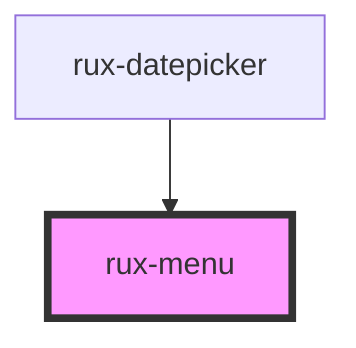

# rux-menu

<!-- Auto Generated Below -->

## Events

| Event             | Description                                                                                   | Type               |
| ----------------- | --------------------------------------------------------------------------------------------- | ------------------ |
| `ruxmenuselected` | Emits when a rux-menu-item is selected. Emits the rux-menu-item selected in the event detail. | `CustomEvent<any>` |

## Dependencies

### Used by

 - [rux-datepicker](../rux-datepicker)

### Graph

----------------------------------------------

*Built with [StencilJS](https://stenciljs.com/)*
