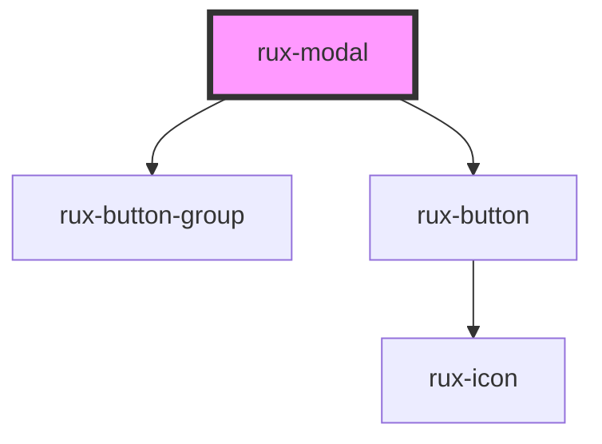

# rux-modal

A Rux Modal interrupts the app experience to prompt a user to confirm an action or acknowledge a piece of information. It displays information along with a set of buttons allowing users to “Accept or Cancel” the actions presented within the Rux Modal.

## Guidelines

-   [Astro UXDS: Rux Modal](https://astrouxds.com/ui-components/dialog-box)

## Web Components Usage

### 1. Installation

#### Download the [Astro UXDS Component Library](https://github.com/RocketCommunicationsInc/astro-components) source to your project.

Via CLI:

```sh
git clone https://github.com/RocketCommunicationsInc/astro-components.git
```

Or, [download the Astro UXDS Components as a .zip](https://github.com/RocketCommunicationsInc/astro-components/archive/master.zip)

### 2. Import the Astro Rux Modal Web Component

This example assumes you're using the NPM package in `node_modules`. Otherwise, import the component using the path to the Astro Components directory in your project.

```javascript
import { RuxModal } from '@astrouxds/rux-modal/rux-modal.js'
```

### 3. Render the Astro Rux Modal Web Component

At a minimum, Astro UXDS Rux Modal requires a message. In this instance, a single button labeled "Cancel" will be automatically rendered.

```xml
<rux-modal message="This is a message"></rux-modal>
```

Pass properties as attributes of the Astro Rux Modal custom element:

```xml
<rux-modal
  title="Modal title"
  message="Modal message"
  confirmText="Ok"
  denyText="Cancel"
  customEvent="listen-for-me">
</rux-modal>
```

<!-- Auto Generated Below -->

## Properties

| Property       | Attribute       | Description                  | Type                  | Default     |
| -------------- | --------------- | ---------------------------- | --------------------- | ----------- |
| `confirmText`  | `confirm-text`  | Text for confirmation button | `string`              | `'Confirm'` |
| `denyText`     | `deny-text`     | Text for close button        | `string`              | `'Cancel'`  |
| `modalMessage` | `modal-message` | Modal body message           | `string \| undefined` | `undefined` |
| `modalTitle`   | `modal-title`   | Modal header title           | `string \| undefined` | `undefined` |
| `open`         | `open`          | Shows and hides modal        | `boolean`             | `false`     |

## Events

| Event            | Description                           | Type                   |
| ---------------- | ------------------------------------- | ---------------------- |
| `ruxmodalclosed` | Event that is fired when modal closes | `CustomEvent<boolean>` |
| `ruxmodalopened` | Event that is fired when modal opens  | `CustomEvent<boolean>` |

## Shadow Parts

| Part               | Description                                                    |
| ------------------ | -------------------------------------------------------------- |
| `"confirm-button"` | the modal's confirm button                                     |
| `"container"`      | the modal container                                            |
| `"deny-button"`    | the modal's deny button                                        |
| `"header"`         | the header of the modal                                        |
| `"message"`        | the message of the modal                                       |
| `"wrapper"`        | the modal wrapper overlay ! DEPRECATED IN FAVOR OF CONTAINER ! |

## CSS Custom Properties

| Name                       | Description            |
| -------------------------- | ---------------------- |
| `--modal-background-color` | Modal background color |
| `--modal-border-color`     | Modal border color     |
| `--modal-title-color`      | Modal title color      |

## Dependencies

### Depends on

-   [rux-button-group](../rux-button-group)
-   [rux-button](../rux-button)

### Graph



---

_Built with [StencilJS](https://stenciljs.com/)_
