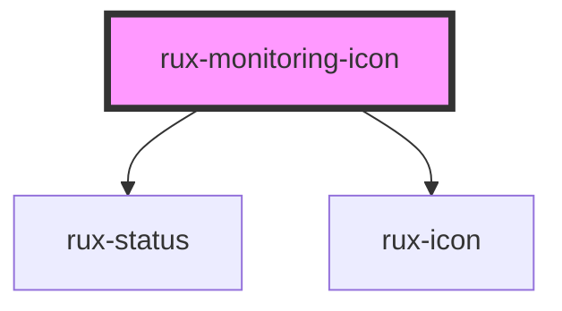

# Monitoring Icon

These icons represent objects, equipment, and concepts that are being administered or monitored. The purpose of these icons is to easily, concisely, and clearly visually communicate their status to be to users.

## Guidelines

-   [Astro UXDS: Icons and Symbols](https://astrouxds.com/ui-components/icons-and-symbols)

## Web Components Usage

### 1. Installation

#### Install the Astro UXDS Monitoring Icon package via Command Line (Preferred Method)

```sh
npm i --save @astrouxds/rux--monitoring-icon
```

You may use Yarn, NPM, or your Node package manager of choice. The `--save` flag adds this component as a dependency in your `package.json` file.

#### **Alternatively**, download the [Astro UXDS Component Library](https://github.com/RocketCommunicationsInc/astro-components) source to your project.

Via CLI:

```sh
git clone https://github.com/RocketCommunicationsInc/astro-components.git
```

Or, [download the Astro UXDS Components as a .zip](https://github.com/RocketCommunicationsInc/astro-components/archive/master.zip)

### 2. Import the Astro Monitoring Icon Web Component

This example assumes you're using the NPM package in `node_modules`. Otherwise, import the component using the path to the Astro Components directory in your project.

```javascript
import { RuxMonitoringIcon } from '@astrouxds/rux-monitoring-icon/rux-monitoring-icon.js'
```

### 3. Render the Astro Monitoring Icon Web Component

Pass properties as attributes of the Astro Monitoring Icon custom element:

```xml
<rux-monitoring-icon
 icon="altitude"
 label="Altitude for satellite X"
 sublabel="10000m"
 status="normal"
 notifications="10">
</rux-monitoring-icon>
```

# Monitoring Progress Icon

The Monitoring Progress Icon is a unique instance of the Monitoring Icon for displaying live progress of a monitored item. The Monitoring Progress Icon uses a "donut"-style progress meter rather than a specific icon.

## Guidelines

-   [Astro UXDS: Icons and Symbols](https://astrouxds.com/ui-components/icons-and-symbols)

## Web Components Usage

### 1. Installation

#### Install the Astro UXDS Monitoring Icon package via Command Line (Preferred Method)

```sh
npm i --save @astrouxds/rux--monitoring-icon
```

You may use Yarn, NPM, or your Node package manager of choice. The `--save` flag adds this component as a dependency in your `package.json` file.

#### **Alternatively**, download the [Astro UXDS Component Library](https://github.com/RocketCommunicationsInc/astro-components) source to your project.

Via CLI:

```sh
git clone https://github.com/RocketCommunicationsInc/astro-components.git
```

Or, [download Astro UXDS Components as a .zip](https://github.com/RocketCommunicationsInc/astro-components/archive/master.zip)

### 2. Import the Astro Monitoring Progress Icon Web Component

This example assumes you're using the NPM package in `node_modules`. Otherwise, import the component using the path to the Astro Components directory in your project. Status is assigned via a range object.

```javascript
import { RuxMonitoringProgressIcon } from '@astrouxds/rux-monitoring-icon/rux-monitoring-progress-icon.js'
```

### 3. Render the Astro Monitoring Progress Icon Web Component

Pass properties as attributes of the Astro Monitoring Progress Icon custom element:

````xml
<rux-monitoring-progress-icon
 label="Battery level"
 progress="50">
</rux-monitoring-progress-icon>


<!-- Auto Generated Below -->


## Properties

| Property             | Attribute       | Description                                                                                                                                                                                                                                                                             | Type                                                                     | Default              |
| -------------------- | --------------- | --------------------------------------------------------------------------------------------------------------------------------------------------------------------------------------------------------------------------------------------------------------------------------------- | ------------------------------------------------------------------------ | -------------------- |
| `icon`               | `icon`          | Displays an Astro icon matching this string. For a [full list of available icons, see the Icons section in Astro UXDS Guidelines](https://astrouxds.com/ui-components/icons-and-symbols)                                                                                                | `string`                                                                 | `'antenna-transmit'` |
| `label` _(required)_ | `label`         | Displays a label below the icon                                                                                                                                                                                                                                                         | `string`                                                                 | `undefined`          |
| `notifications`      | `notifications` | If provided and greater than `0`, displays an outlined number badge at the bottom right of the icon. Numbers above `9999` are abbreviated to `'10K'` or `'100K'` for numbers in the thousands, `'1.5M'` for millions, `'1.5B'` for billions, and uses `'∞'` for one trillion or higher. | `number`                                                                 | `0`                  |
| `size`               | `size`          | The size of a chosen Astro icon. Can be 'extra-small', 'small', 'normal', 'large', 'auto' or any custom value ('30px', '1rem', '3.321em')                                                                                                                                               | `string`                                                                 | `'2.5rem'`           |
| `status`             | `status`        | Styles the icon according to the Astro Status colors. Valid options are the Astro statuses `critical`, `serious`, `caution`, `normal`, `standby`, and `off`.                                                                                                                            | `"caution" \| "critical" \| "normal" \| "off" \| "serious" \| "standby"` | `'normal'`           |
| `sublabel`           | `sublabel`      | Displays a smaller label underneath the icon label                                                                                                                                                                                                                                      | `string \| undefined`                                                    | `undefined`          |


## Shadow Parts

| Part                    | Description                        |
| ----------------------- | ---------------------------------- |
| `"container"`           | the components container           |
| `"monitoring-badge"`    | The component's notification badge |
| `"monitoring-label"`    | The component's label              |
| `"monitoring-sublabel"` | The component's sublabel           |
| `"status-icon"`         | the components status symbol       |


## Dependencies

### Depends on

- [rux-status](../rux-status)
- [rux-icon](../rux-icon)

### Graph


----------------------------------------------

*Built with [StencilJS](https://stenciljs.com/)*
