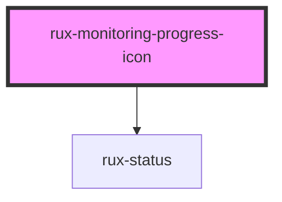

# Monitoring Progress Icon

The Monitoring Progress Icon is a unique instance of the Monitoring Icon for displaying live progress of a monitored item. The Monitoring Progress Icon uses a "donut"-style progress meter rather than a specific icon.

## Guidelines

-   [Astro UXDS: Icons and Symbols](https://astrouxds.com/ui-components/icons-and-symbols)

## Web Components Usage

### 1. Installation

#### Install the Astro UXDS Monitoring Icon package via Command Line (Preferred Method)

```sh
npm i --save @astrouxds/rux--monitoring-icon
```

You may use Yarn, NPM, or your Node package manager of choice. The `--save` flag adds this component as a dependency in your `package.json` file.

#### **Alternatively**, download the [Astro UXDS Component Library](https://github.com/RocketCommunicationsInc/astro) source to your project.

Via CLI:

```sh
git clone https://github.com/RocketCommunicationsInc/astro.git
```

Or, [download Astro UXDS Components as a .zip](https://github.com/RocketCommunicationsInc/astro/archive/master.zip)

### 2. Import the Astro Monitoring Progress Icon Web Component

This example assumes you're using the NPM package in `node_modules`. Otherwise, import the component using the path to the Astro Components directory in your project. Status is assigned via a range object.

```javascript
import { RuxMonitoringProgressIcon } from '@astrouxds/rux-monitoring-icon/rux-monitoring-progress-icon.js'
```

### 3. Render the Astro Monitoring Progress Icon Web Component

Pass properties as attributes of the Astro Monitoring Progress Icon custom element:

```xml
<rux-monitoring-progress-icon
 label="Battery level"
 progress="50">
</rux-monitoring-progress-icon>
```

### Sample `range` Array

A sample of a `range` Array. This sample is also the default value for `range`. Note: `range` Arrays can have as few as one threshold for items that may need progress observation, but won't have an associated status.

```json
[
    {
        // for progress values from 0 to 17:
        "threshold": 17,
        "status": "off"
    },
    {
        // for progress values from 18 to 33:
        "threshold": 33,
        "status": "standby"
    },
    {
        // for progress values from 34 to 49:
        "threshold": 49,
        "status": "normal"
    },
    {
        // for progress values from 50 to 65:
        "threshold": 65,
        "status": "caution"
    },
    {
        // for progress values from 66 to 81:
        "threshold": 81,
        "status": "serious"
    },
    {
        // for progress values from 82 to 100:
        "threshold": 100,
        "status": "critical"
    }
]
```

### `range` Array Item Properties

| Property    | Type   | Default  | Required | Description                                                                                                                                                 |
| ----------- | ------ | -------- | -------- | ----------------------------------------------------------------------------------------------------------------------------------------------------------- |
| `threshold` | Number | —        | Yes      | This value is the upper limit, exclusive, of the range for which the `status` below will style the progress icon.                                           |
| `status`    | String | `normal` | Yes      | Styles the icon according to the Astro Status colors. Valid options are the Astro statuses `critical`, `serious`, `caution`, `normal`, `standby`, and `off` |

<!-- Auto Generated Below -->

## Properties

| Property             | Attribute       | Description                                                                                                                                                                                                                                                                                                                                                                                                                                                                                                                        | Type                  | Default     |
| -------------------- | --------------- | ---------------------------------------------------------------------------------------------------------------------------------------------------------------------------------------------------------------------------------------------------------------------------------------------------------------------------------------------------------------------------------------------------------------------------------------------------------------------------------------------------------------------------------- | --------------------- | ----------- |
| `label`              | `label`         | Displays a label below the icon                                                                                                                                                                                                                                                                                                                                                                                                                                                                                                    | `string \| undefined` | `undefined` |
| `max`                | `max`           | Sets the maximum value for the progress range. When progress is this number, it reads 100%. When it is halfway between min and max, it will read 50%.                                                                                                                                                                                                                                                                                                                                                                              | `number`              | `100`       |
| `min`                | `min`           | Sets the minimum value for the progress range. When progress is this number, it reads 0%. When it is halfway between min and max, it will read 50%.                                                                                                                                                                                                                                                                                                                                                                                | `number`              | `0`         |
| `notifications`      | `notifications` | If provided and greater than `0`, displays an outlined number badge at the bottom right of the icon. Numbers above `9999` are abbreviated to `'10K'` or `'100K'` for numbers in the thousands, `'1.5M'` for millions, `'1.5B'` for billions, and `'∞'` for one trillion or higher.                                                                                                                                                                                                                                                 | `number \| undefined` | `undefined` |
| `progress`           | `progress`      | Displays this value as a percentage of where it lies between min and max in the center of the donut graph and styles a proportional segment of the graph. Progress can be positive or negative (the later useful for countdowns). The progress value must exist within the thresholds specified in the range property below, and must be an integer. If a non-integer value is passed in, progress will default to 0. If progress ever becomes less than min or greater than max, it will be set to equal min or max respectively. | `number`              | `0`         |
| `range` _(required)_ | --              | Items in this Array define thresholds for changing the status style of the progress icon. For each item in the Array, the icon will be styled with the given status while the progress value is less than or equal to the Array item’s threshold and greater than the next smallest item‘s threshold. Both progress and the Array items’ threshold values can be positive or negative. If no min is specified, the component assumes the Array's first status threshold begins at 0.                                               | `RangeItem[]`         | `undefined` |
| `sublabel`           | `sublabel`      | Displays a smaller label underneath the icon label                                                                                                                                                                                                                                                                                                                                                                                                                                                                                 | `string \| undefined` | `undefined` |

## Dependencies

### Depends on

-   [rux-status](../rux-status)

### Graph



---

_Built with [StencilJS](https://stenciljs.com/)_
