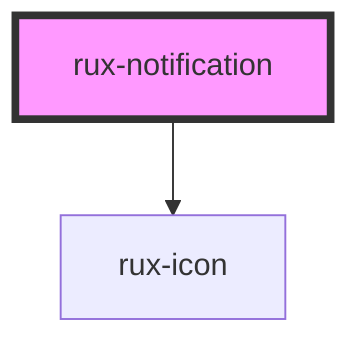

# Notification Banner

Events that deserve user attention, but don’t require a response, may be displayed in a Notification Banner. The Banner displays within the user’s field-of-view, but doesn’t block other interaction.

If the user is currently working in a specific screen area, the Banner may be presented in that area. If the Notification is more general, or doesn’t relate to a specific area of the screen, it may be presented in the center of the screen just below the Global Status Bar.

If another Notification Banner is waiting, it appears when the current Banner is dismissed. Banners don’t stack or group.

## Guidelines

-   [Astro UXDS: Notification Banner](https://www.astrouxds.com/ui-components/notification-banner)

## Web Components Usage

### 1. Installation

#### Install the Astro UXDS Notification Banner package via Command Line (Preferred Method)

The name of the package reflects its earlier history as Astro UXDS Modal.

```sh
npm i --save @astrouxds/rux-notification
```

You may use Yarn, NPM, or your Node package manager of choice. The `--save` flag adds this component as a dependency in your `package.json` file.

#### **Alternatively**, download the [Astro UXDS Component Library](https://github.com/RocketCommunicationsInc/astro-components) source to your project.

Via CLI:

```sh
git clone https://github.com/RocketCommunicationsInc/astro-components.git
```

Or, [download the Astro UXDS Components as a .zip](https://github.com/RocketCommunicationsInc/astro-components/archive/master.zip)

### 2. Import the Astro Notification Banner Web Component

This example assumes you're using the NPM package in `node_modules`. Otherwise, import the component using the path to the Astro Components directory in your project.

```javascript
import { RuxNotification } from '@astrouxds/rux-notification/rux-notification.js'
```

### 3. Render the Astro Notification Banner Web Component

Pass properties as attributes of the Astro Notification Banner custom element. At a minimum, the component requires a message and the `open` attribute.

```xml
 <rux-notification open message="This is a notification message"></rux-notification>
```

You can toggle the display of the banner via the `open` attribute, which begins the self-close behavior after the `close-after` duration.

```xml
<rux-notification
  open
  close-after="3500"
  status="caution"
  message="This is an important notification which will disappear in 3.5 seconds.">
</rux-notification>
```

#### ** Usage Note: **

The Astro UXDS Notification Banner hides from view using absolute positioning in CSS to slide up and outside of the parent element's content area. To ensure the notification hides properly, make sure the Notification Banner's parent element has both `position: relative` and `overflow: hidden` applied.

<!-- Auto Generated Below -->


## Properties

| Property     | Attribute     | Description                                                                                                                                                                                                                                                                                                                                                                                                                                                                                      | Type                                                                     | Default     |
| ------------ | ------------- | ------------------------------------------------------------------------------------------------------------------------------------------------------------------------------------------------------------------------------------------------------------------------------------------------------------------------------------------------------------------------------------------------------------------------------------------------------------------------------------------------ | ------------------------------------------------------------------------ | ----------- |
| `closeAfter` | `close-after` | If provided, the banner will automatically close after this amount of time. Accepts value either in milliseconds or seconds (which will be converted to milliseconds internally), between `2000` and `10000`, or `2` and `10`, respectively. Any number provided outside of the `2000`-`10000` range will be ignored in favor of the default 2000ms delay. <br>If `closeAfter` is not passed or if it is given an undefined or `null` value, the banner will stay open until the user closes it. | `number \| undefined`                                                    | `undefined` |
| `message`    | `message`     | Message for the notification banner.                                                                                                                                                                                                                                                                                                                                                                                                                                                             | `string`                                                                 | `''`        |
| `open`       | `open`        | Set to true to display the Banner and begin countdown to close (if a close-after Number value is provided).                                                                                                                                                                                                                                                                                                                                                                                      | `boolean`                                                                | `false`     |
| `small`      | `small`       | Changes the size of the banner to a small variant.                                                                                                                                                                                                                                                                                                                                                                                                                                               | `boolean`                                                                | `false`     |
| `status`     | `status`      | The background color. Possible values include 'off', 'standby', 'normal', 'caution', 'serious' and 'critical'. See [Astro UXDS Status System](https://astrouxds.com/patterns/status-system/).                                                                                                                                                                                                                                                                                                    | `"caution" \| "critical" \| "normal" \| "off" \| "serious" \| "standby"` | `'standby'` |


## Events

| Event       | Description                                  | Type                   |
| ----------- | -------------------------------------------- | ---------------------- |
| `ruxclosed` | Fires when the notification banner is closed | `CustomEvent<boolean>` |


## Shadow Parts

| Part        | Description               |
| ----------- | ------------------------- |
| `"icon"`    | the icon of rux-icon      |
| `"message"` | the notifications message |


## Dependencies

### Depends on

- [rux-icon](../rux-icon)

### Graph


----------------------------------------------

*Built with [StencilJS](https://stenciljs.com/)*
