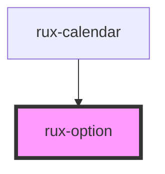

# rux-option

<!-- Auto Generated Below -->

## Overview

This component should be used exclusively with RuxSelect.
It's main function is to broadcast to RuxSelect when the value property changes.
RuxSelect can only listen for slot change, which won't fire in the scenario where there
might be 2 options and only their values change. Because the nodes themselves aren't added or removed,
onSlotchange doesn't fire.

## Properties

| Property             | Attribute  | Description                 | Type      | Default     |
| -------------------- | ---------- | --------------------------- | --------- | ----------- |
| `disabled`           | `disabled` | Sets the option as disabled | `boolean` | `false`     |
| `label` _(required)_ | `label`    | The option label            | `string`  | `undefined` |
| `value` _(required)_ | `value`    | The option value            | `string`  | `undefined` |

## Dependencies

### Used by

 - [rux-calendar](../rux-calendar)

### Graph

----------------------------------------------

*Built with [StencilJS](https://stenciljs.com/)*
