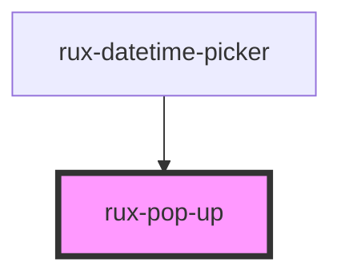

# rux-pop-up

<!-- Auto Generated Below -->

## Properties

| Property               | Attribute                | Description                                                                                                | Type                                                                                                                                                                           | Default      |
| ---------------------- | ------------------------ | ---------------------------------------------------------------------------------------------------------- | ------------------------------------------------------------------------------------------------------------------------------------------------------------------------------ | ------------ |
| `closeOnSelect`        | `close-on-select`        | When provided, will close the pop-up when a single selection is made.                                      | `boolean`                                                                                                                                                                      | `false`      |
| `disableAutoUpdate`    | `disable-auto-update`    | Turns autoUpdate on or off which makes the pop-up move to stay in view based on scroll. Defaults to false. | `boolean`                                                                                                                                                                      | `false`      |
| `enableAnimationFrame` | `enable-animation-frame` | watches for trigger movements and replace the popup if movement is detected.                               | `boolean`                                                                                                                                                                      | `false`      |
| `open`                 | `open`                   | Determines if the pop up is open or closed                                                                 | `boolean`                                                                                                                                                                      | `false`      |
| `placement`            | `placement`              | The placement of the pop up relative to it's slotted trigger element. Defaults to auto.                    | `"auto" \| "bottom" \| "bottom-end" \| "bottom-start" \| "left" \| "left-end" \| "left-start" \| "right" \| "right-end" \| "right-start" \| "top" \| "top-end" \| "top-start"` | `'auto'`     |
| `strategy`             | `strategy`               | The position strategy of the popup, either absolute or fixed.                                              | `"absolute" \| "fixed"`                                                                                                                                                        | `'absolute'` |

## Events

| Event            | Description                       | Type               |
| ---------------- | --------------------------------- | ------------------ |
| `ruxpopupclosed` | Emits when the pop up has closed. | `CustomEvent<any>` |
| `ruxpopupopened` | Emits when the pop up has opened  | `CustomEvent<any>` |

## Methods

### `hide() => Promise<false>`

Closes the pop up and returns false.

#### Returns

Type: `Promise<false>`

### `show() => Promise<true>`

Opens the pop up and returns true.

#### Returns

Type: `Promise<true>`

## Slots

| Slot          | Description                        |
| ------------- | ---------------------------------- |
| `"(default)"` | The contents for rux-pop-up        |
| `"trigger"`   | The trigger element for rux-pop-up |

## Shadow Parts

| Part                  | Description                                         |
| --------------------- | --------------------------------------------------- |
| `"arrow"`             | the arrow pointing to the trigger of rux-pop-up     |
| `"container"`         | the container of rux-pop-up                         |
| `"popup-content"`     | the content that is shown when rux-pop-up is opened |
| `"trigger-container"` | the container of the pop-up trigger                 |

## Dependencies

### Used by

 - [rux-datetime-picker](../rux-datetime-picker)

### Graph

----------------------------------------------

*Built with [StencilJS](https://stenciljs.com/)*
