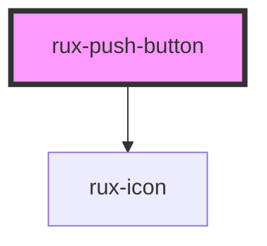

# Push Button

Pushbuttons are a variant of the toggle button which incorporate label and action into a single user interface element. Pushbuttons may provide a useful interface element where screen real estate is at a premium.

## Guidelines

-   [Astro UXDS: Toggle & Push Button](http://www.astrouxds.com/ui-components/toggle)

## Web Components Usage

### 1. Installation

#### Install the Astro UXDS Push Button package via Command Line (Preferred Method)

```sh
npm i --save @astrouxds/rux-push-button
```

You may use Yarn, NPM, or your Node package manager of choice. The `--save` flag adds this component as a dependency in your `package.json` file.

#### **Alternatively**, download the [Astro UXDS Component Library](https://github.com/RocketCommunicationsInc/astro-components/) source to your project.

Via CLI:

```sh
git clone https://github.com/RocketCommunicationsInc/astro-components.git
```

Or, [download the Astro UXDS Components as a .zip](https://github.com/RocketCommunicationsInc/astro-components/archive/master.zip)

### 2. Import the Astro Push Button Web Component

This example assumes you're using the NPM package in `node_modules`. Otherwise, import the component using the path to the Astro Components directory in your project.

```javascript
import { RuxPushButton } from '@astrouxds/rux-push-button/rux-push-button.js'
```

### 3. Render the Astro Push Button Web Component

Pass properties as attributes of the Astro Push Button custom element.

Provide a label for the Push Button inside the component node using the component’s [slot](https://developer.mozilla.org/en-US/docs/Web/HTML/Element/slot).

```xml
<rux-push-button checked>Push button label</rux-push-button>
```

## Basic HTML Usage

### 1. Include the Astro UXDS CSS file

Latest release is available in the [static css directory](https://github.com/RocketCommunicationsInc/astro-components/tree/master/static/css).

```xml
<link rel="stylesheet" href="/your-project/path/astro.css" />
```

### 2. Markup the component using HTML and the Astro CSS classes

Astro CSS classes follow the [BEM-style](http://getbem.com/introduction/) naming convention.

```xml
 <div class="rux-push-button">
  <input class="rux-push-button__input" id="pb1" type="checkbox"></input>
  <label class="rux-push-button__button" for="pb1">Push button label</label>
</div>
```

Apply attributes such as `disabled` and/or `checked` on the `<input>` element.

```xml
 <div class="rux-push-button">
  <input class="rux-push-button__input" id="pb1" type="checkbox" disabled checked></input>
  <label class="rux-push-button__button" for="pb1">Push button label</label>
</div>
```

### Attributes

| Attribute  | Type    | Default | Required | Description                                                                                                                                                                                 |
| ---------- | ------- | ------- | -------- | ------------------------------------------------------------------------------------------------------------------------------------------------------------------------------------------- |
| `disabled` | Boolean | `false` | No       | Disables the button via HTML `disabled` attribute. Button takes on a distinct visual state. Cursor uses the `not-allowed` system replacement and all keyboard and mouse events are ignored. |
| `checked`  | Boolean | `false` | No       | Checks the button via HTML `checked` attribute. Button takes on a distinct "enabled" or "selected" visual state.                                                                            |

For more information about AstroUXDS usage outside of a Web Component environment, please see [Astro UXDS Stylesheets](https://www.astrouxds.com/components/readme/#getting-started-with-html-%26-css)

## Revision History

##### **4.0**

-   Replaced [Polymer 3](https://www.polymer-project.org) implementation with [LitElement](https://lit-element.polymer-project.org/) for improved speed and interoperability with JS Frameworks as well as simpler template declaration now available in vanilla JavaScript.

##### **2.1**

-   Moved Pushbuttons to its own style sheet

##### **1.4**

-   Added `rux_` prefixes and BEM-compatible classes to all `satcom_`-prefixed elements. NOTE: `satcom_` will be removed in a future version
-   Removed prefixed linear gradients
-   Removed prefixed transition
-   Fixed added colon to checked pseudo class (e.g., checked became :checked)
-   Alignment issue fixed on toggle button label
-   Updated to WCAG colors
-   Updated transition speed

<!-- Auto Generated Below -->


## Properties

| Property   | Attribute   | Description                                                                                                                                                                                                                                                                                                   | Type                                          | Default         |
| ---------- | ----------- | ------------------------------------------------------------------------------------------------------------------------------------------------------------------------------------------------------------------------------------------------------------------------------------------------------------- | --------------------------------------------- | --------------- |
| `checked`  | `checked`   | Checks the push button via HTML `checked` attribute. Push button takes on a distinct "enabled" or "selected" visual state.                                                                                                                                                                                    | `boolean`                                     | `false`         |
| `disabled` | `disabled`  | Disables the push button via HTML `disabled` attribute. Button takes on a distinct disabled visual state. Cursor uses the `not-allowed` system replacement and all keyboard and mouse events are ignored.                                                                                                     | `boolean`                                     | `false`         |
| `icon`     | `icon`      | For a [button style guide, see the Button section in Astro UXDS Guidelines](https://astrouxds.com/components/button) Displays an Astro icon matching this string. For a [full list of available icons, see the Icons section in Astro UXDS Guidelines](https://astrouxds.com/ui-components/icons-and-symbols) | `string \| undefined`                         | `undefined`     |
| `iconOnly` | `icon-only` | Hides slotted text from the button by setting rux-button--icon-only class                                                                                                                                                                                                                                     | `boolean`                                     | `false`         |
| `label`    | `label`     | The label of the push button.                                                                                                                                                                                                                                                                                 | `string`                                      | `'Push Button'` |
| `name`     | `name`      | The name of the push button.                                                                                                                                                                                                                                                                                  | `string`                                      | `''`            |
| `size`     | `size`      | Changes size of a push button from medium to small or large by setting sizing classes rux-button--small rux-button--large                                                                                                                                                                                     | `"large" \| "medium" \| "small" \| undefined` | `undefined`     |
| `value`    | `value`     | The value of the push button.                                                                                                                                                                                                                                                                                 | `string`                                      | `''`            |


## Events

| Event       | Description                                                                                                                                                                    | Type               |
| ----------- | ------------------------------------------------------------------------------------------------------------------------------------------------------------------------------ | ------------------ |
| `ruxblur`   | Fired when an element has lost focus - [HTMLElement/blur_event](https://developer.mozilla.org/en-US/docs/Web/API/Element/blur_event)                                           | `CustomEvent<any>` |
| `ruxchange` | Fired when an alteration to the input's value is committed by the user - [HTMLElement/change_event](https://developer.mozilla.org/en-US/docs/Web/API/HTMLElement/change_event) | `CustomEvent<any>` |


## Shadow Parts

| Part      | Description                  |
| --------- | ---------------------------- |
| `"icon"`  | the optional rux-icon        |
| `"label"` | the label of rux-push-button |


## Dependencies

### Depends on

- [rux-icon](../rux-icon)

### Graph


----------------------------------------------

*Built with [StencilJS](https://stenciljs.com/)*
