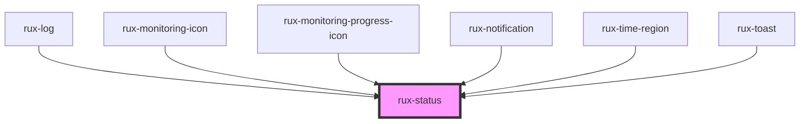

# rux-status

<!-- Auto Generated Below -->

## Properties

| Property | Attribute | Description                                                                                   | Type                                                                                  | Default    |
| -------- | --------- | --------------------------------------------------------------------------------------------- | ------------------------------------------------------------------------------------- | ---------- |
| `status` | `status`  | Sets the status symbol, valid options are critical, serious, caution, normal, standby and off | `"caution" \| "critical" \| "normal" \| "off" \| "serious" \| "standby" \| undefined` | `'normal'` |

## Shadow Parts

| Part       | Description                            |
| ---------- | -------------------------------------- |
| `"status"` | the container of the rux-status symbol |

## Dependencies

### Used by

 - [rux-log](../rux-log)
 - [rux-monitoring-icon](../rux-monitoring-icon)
 - [rux-monitoring-progress-icon](../rux-monitoring-progress-icon)
 - [rux-notification](../rux-notification)
 - [rux-time-region](../rux-timeline/rux-time-region)
 - [rux-toast](../rux-toast)

### Graph

----------------------------------------------

*Built with [StencilJS](https://stenciljs.com/)*
