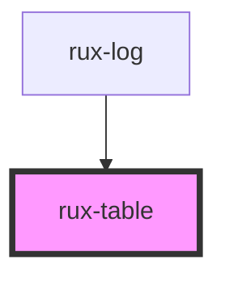

# rux-table

<!-- Auto Generated Below -->


## Usage

### Simple

```html
<rux-table>
    <rux-table-header>
        <rux-table-header-row>
            <rux-table-header-cell> Header 1 </rux-table-header-cell>
            <rux-table-header-cell> Header 2 </rux-table-header-cell>
        </rux-table-header-row>
    </rux-table-header>
    <rux-table-body>
        <rux-table-row>
            <rux-table-cell> Data </rux-table-cell>
            <rux-table-cell> Data </rux-table-cell>
        </rux-table-row>
    </rux-table-body>
</rux-table>
```


## Dependencies

### Used by

 - [rux-log](../rux-log)

### Graph


----------------------------------------------

*Built with [StencilJS](https://stenciljs.com/)*
