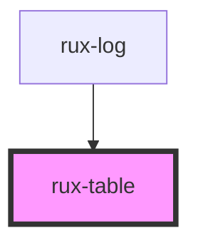

# rux-table

<!-- Auto Generated Below -->

## Usage

### Simple

```html
<rux-table>
    <rux-table-header>
        <rux-table-header-row>
            <rux-table-header-cell> Header 1 </rux-table-header-cell>
            <rux-table-header-cell> Header 2 </rux-table-header-cell>
        </rux-table-header-row>
    </rux-table-header>
    <rux-table-body>
        <rux-table-row>
            <rux-table-cell> Data </rux-table-cell>
            <rux-table-cell> Data </rux-table-cell>
        </rux-table-row>
    </rux-table-body>
</rux-table>
```

## CSS Custom Properties

| Name                                    | Description                         |
| --------------------------------------- | ----------------------------------- |
| `--table-border-color`                  | Table background color              |
| `--table-header-background-color`       | Table header background color       |
| `--table-header-border-color`           | Table header border color           |
| `--table-header-box-shadow`             | Table header box shadow             |
| `--table-header-text-color`             | Table header text color             |
| `--table-row-background-color`          | Table row background color          |
| `--table-row-border-color`              | Table row border color              |
| `--table-row-hover-background-color`    | Table row hover background color    |
| `--table-row-hover-text-color`          | Table row hover text color          |
| `--table-row-selected-background-color` | Table row selected background color |
| `--table-row-selected-border-color`     | Table row selected border color     |
| `--table-row-text-color`                | Table row text color                |

## Dependencies

### Used by

-   [rux-log](../rux-log)

### Graph



---

_Built with [StencilJS](https://stenciljs.com/)_
