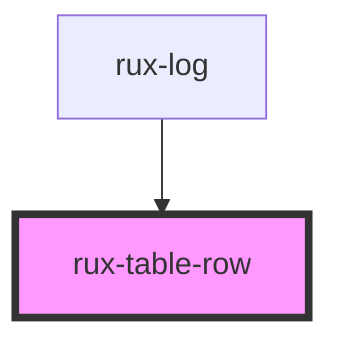

# rux-table-row

<!-- Auto Generated Below -->

## Properties

| Property   | Attribute  | Description                                                                       | Type      | Default |
| ---------- | ---------- | --------------------------------------------------------------------------------- | --------- | ------- |
| `selected` | `selected` | Changes the background color of the row. Can be applied to multiple rows at once. | `boolean` | `false` |

## Dependencies

### Used by

-   [rux-log](../../rux-log)

### Graph

---

_Built with [StencilJS](https://stenciljs.com/)_
