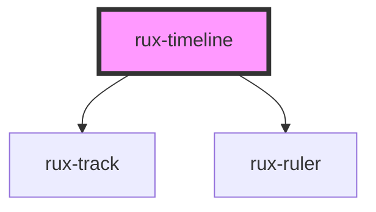

# rux-timeline

<!-- Auto Generated Below -->

## Properties

| Property             | Attribute              | Description                                                                                                                       | Type                                               | Default     |
| -------------------- | ---------------------- | --------------------------------------------------------------------------------------------------------------------------------- | -------------------------------------------------- | ----------- |
| `end`                | `end`                  | The timeline's end date. Must be an ISO string "2021-02-02T05:00:00Z"                                                             | `string`                                           | `''`        |
| `hasPlayedIndicator` | `has-played-indicator` | Visually marks past time as played in each track                                                                                  | `boolean`                                          | `false`     |
| `interval`           | `interval`             | The timeline's date time interval                                                                                                 | `"day" \| "hour" \| "minute" \| "month" \| "week"` | `'hour'`    |
| `playhead`           | `playhead`             | The timeline's playhead date time. Must be an ISO string "2021-02-02T05:00:00Z"                                                   | `string \| undefined`                              | `undefined` |
| `rulerPosition`      | `ruler-position`       | Controls the position of the ruler. Either top, bottom or both.                                                                   | `"both" \| "bottom" \| "top"`                      | `'both'`    |
| `showGrid`           | `show-grid`            | Controls the display of grid lines                                                                                                | `boolean`                                          | `false`     |
| `showSecondaryRuler` | `show-secondary-ruler` | Controls wether or not the attached rux-ruler displays the secondary date portion.                                                | `boolean`                                          | `false`     |
| `start`              | `start`                | The timeline's start date. Must be an ISO string "2021-02-02T05:00:00Z"                                                           | `string`                                           | `''`        |
| `timezone`           | `timezone`             | Controls the timezone that the timeline is localized to. Must be an IANA time zone name ("America/New_York") or an offset string. | `string`                                           | `'UTC'`     |
| `zoom`               | `zoom`                 | The timeline's zoom level.                                                                                                        | `number`                                           | `1`         |

## Shadow Parts

| Part                      | Description                                                                                          |
| ------------------------- | ---------------------------------------------------------------------------------------------------- |
| `"playhead"`              | The timeline's playhead                                                                              |
| `"time-region-container"` | The container for time regions. Use this part to set a maximum height and enable vertical scrolling. |

## Dependencies

### Depends on

- [rux-track](rux-track)
- [rux-ruler](rux-ruler)

### Graph

----------------------------------------------

*Built with [StencilJS](https://stenciljs.com/)*
