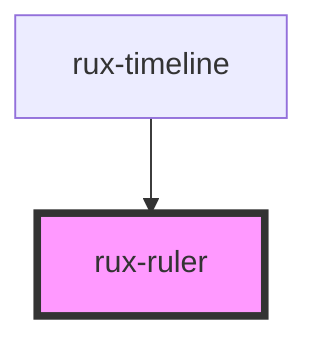

# rux-ruler

<!-- Auto Generated Below -->

## Properties

| Property         | Attribute           | Description                                                                                                                                                                                                                                                                                                                  | Type                   | Default |
| ---------------- | ------------------- | ---------------------------------------------------------------------------------------------------------------------------------------------------------------------------------------------------------------------------------------------------------------------------------------------------------------------------- | ---------------------- | ------- |
| `showStartOfDay` | `show-start-of-day` | **[DEPRECATED]** This property is deprecated and will be removed in the next major release. Please use the `show-secondary-ruler` property on the rux-timeline component instead.  Display the day (MM/DD) at 00:00. Only works when Timeline interval is set to 'hour' or 'minutes'. | `boolean \| undefined` | `false` |

## Dependencies

### Used by

 - [rux-timeline](..)

### Graph

----------------------------------------------

*Built with [StencilJS](https://stenciljs.com/)*
