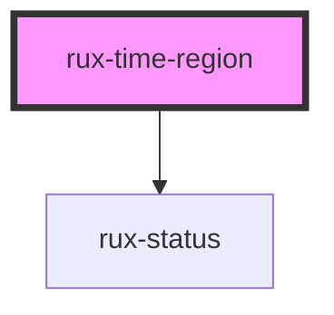

# rux-time-region

<!-- Auto Generated Below -->

## Properties

| Property        | Attribute        | Description                                                                                                                                      | Type                                                                         | Default     |
| --------------- | ---------------- | ------------------------------------------------------------------------------------------------------------------------------------------------ | ---------------------------------------------------------------------------- | ----------- |
| `end`           | `end`            | The end date. Must be an ISO string "2021-02-02T05:00:00Z"                                                                                       | `string`                                                                     | `''`        |
| `hideTimestamp` | `hide-timestamp` | Optionally hide the bottom right timestamp.                                                                                                      | `boolean`                                                                    | `false`     |
| `partial`       | `partial`        | Visually indicates a partial time regions. Partial time regions are time regions that start or end outside of the current range of the timeline. | `"end" \| "none" \| "ongoing" \| "start"`                                    | `'none'`    |
| `selected`      | `selected`       | Visually displays the selected state                                                                                                             | `boolean`                                                                    | `false`     |
| `start`         | `start`          | The start date. Must be an ISO string "2021-02-02T05:00:00Z".                                                                                    | `string`                                                                     | `''`        |
| `status`        | `status`         | Short hand attribute for displaying a Status icon and appropriate border color.                                                                  | `"caution" \| "critical" \| "normal" \| "serious" \| "standby" \| undefined` | `undefined` |

## Slots

| Slot          | Description                    |
| ------------- | ------------------------------ |
| `"(default)"` | The content of the Time Region |

## Shadow Parts

| Part                      | Description                                                                                          |
| ------------------------- | ---------------------------------------------------------------------------------------------------- |
| `"container"`             | The component's container                                                                            |
| `"time-region-container"` | The container for time regions. Use this part to set a maximum height and enable vertical scrolling. |
| `"timestamp"`             | The time region's timestamp                                                                          |

## Dependencies

### Depends on

- [rux-status](../../rux-status)

### Graph

----------------------------------------------

*Built with [StencilJS](https://stenciljs.com/)*
