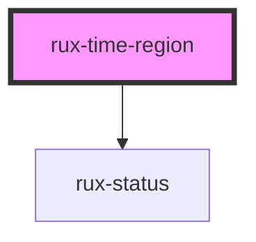

# rux-time-region

<!-- Auto Generated Below -->

## Properties

| Property        | Attribute        | Description                                                                     | Type                                                                         | Default     |
| --------------- | ---------------- | ------------------------------------------------------------------------------- | ---------------------------------------------------------------------------- | ----------- |
| `end`           | `end`            | The end time                                                                    | `any`                                                                        | `undefined` |
| `hideTimestamp` | `hide-timestamp` | Optionally hide the bottom right timestamp.                                     | `boolean`                                                                    | `false`     |
| `selected`      | `selected`       | Visually displays the selected state                                            | `boolean`                                                                    | `false`     |
| `start`         | `start`          | The start time                                                                  | `any`                                                                        | `undefined` |
| `status`        | `status`         | Short hand attribute for displaying a Status icon and appropriate border color. | `"caution" \| "critical" \| "normal" \| "serious" \| "standby" \| undefined` | `undefined` |

## Slots

| Slot          | Description                    |
| ------------- | ------------------------------ |
| `"(default)"` | The content of the Time Region |

## Shadow Parts

| Part          | Description |
| ------------- | ----------- |
| `"container"` |             |

## Dependencies

### Depends on

- [rux-status](../../rux-status)

### Graph

----------------------------------------------

*Built with [StencilJS](https://stenciljs.com/)*
