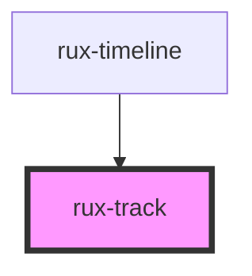

# rux-track

<!-- Auto Generated Below -->

## Properties

| Property   | Attribute  | Description                | Type  | Default     |
| ---------- | ---------- | -------------------------- | ----- | ----------- |
| `playhead` | `playhead` | The playhead of rux-track. | `any` | `undefined` |

## Slots

| Slot          | Description         |
| ------------- | ------------------- |
| `"(default)"` | The Track's content |

## Shadow Parts

| Part             | Description           |
| ---------------- | --------------------- |
| `"container"`    | The Track's container |
| `"track-header"` | The Track's header    |

## Dependencies

### Used by

 - [rux-timeline](..)

### Graph

----------------------------------------------

*Built with [StencilJS](https://stenciljs.com/)*
