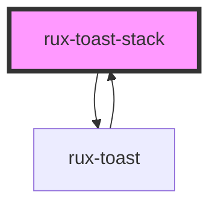

# rux-toast-stack

<!-- Auto Generated Below -->

## Properties

| Property   | Attribute  | Description                         | Type     | Default       |
| ---------- | ---------- | ----------------------------------- | -------- | ------------- |
| `position` | `position` | position of toast stack in viewport | `string` | `'top-right'` |

## Methods

### `addToast(props: { [x: string]: any; hasOwnProperty: (arg0: string) => any; }) => Promise<void>`

#### Returns

Type: `Promise<void>`

## Slots

| Slot          | Description         |
| ------------- | ------------------- |
| `"(default)"` | where all toasts go |

## Dependencies

### Used by

 - [rux-toast](../rux-toast)

### Depends on

- [rux-toast](../rux-toast)

### Graph

----------------------------------------------

*Built with [StencilJS](https://stenciljs.com/)*
