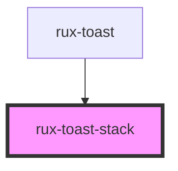

# rux-toast-stack

<!-- Auto Generated Below -->

## Properties

| Property        | Attribute        | Description                                        | Type      | Default       |
| --------------- | ---------------- | -------------------------------------------------- | --------- | ------------- |
| `animateToasts` | `animate-toasts` | Enables animation on all toasts                    | `boolean` | `false`       |
| `maxToasts`     | `max-toasts`     | sets max number of toasts to be displayed in stack | `number`  | `4`           |
| `position`      | `position`       | position of toast stack in viewport                | `string`  | `'top-right'` |

## Slots

| Slot          | Description         |
| ------------- | ------------------- |
| `"(default)"` | where all toasts go |

## Dependencies

### Used by

 - [rux-toast](../rux-toast)

### Graph

----------------------------------------------

*Built with [StencilJS](https://stenciljs.com/)*
