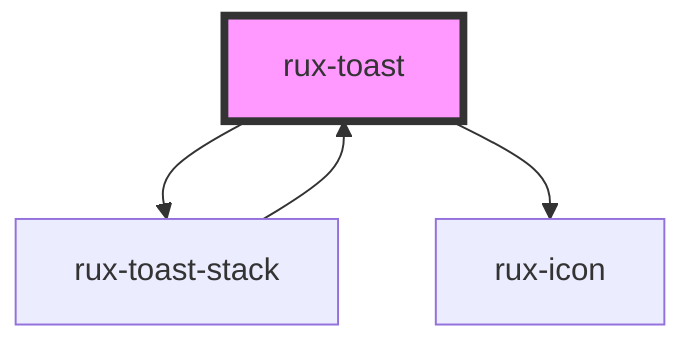

# rux-toast

<!-- Auto Generated Below -->

## Properties

| Property     | Attribute     | Description                                                                                                                                                                                                                                                                                                                                                                                                                                                                                    | Type                                                                                  | Default     |
| ------------ | ------------- | ---------------------------------------------------------------------------------------------------------------------------------------------------------------------------------------------------------------------------------------------------------------------------------------------------------------------------------------------------------------------------------------------------------------------------------------------------------------------------------------------- | ------------------------------------------------------------------------------------- | ----------- |
| `animated`   | `animated`    | Enables closing animation                                                                                                                                                                                                                                                                                                                                                                                                                                                                      | `boolean \| undefined`                                                                | `false`     |
| `closeAfter` | `close-after` | If provided, the toast will automatically close after this amount of time. Accepts value either in milliseconds or seconds (which will be converted to milliseconds internally), between `2000` and `10000`, or `2` and `10`, respectively. Any number provided outside of the `2000`-`10000` range will be ignored in favor of the default 2000ms delay.  If `closeAfter` is not passed or if it is given an undefined or `null` value, the toast will stay open until the user closes it. | `number \| undefined`                                                                 | `undefined` |
| `hideClose`  | `hide-close`  | Prevents the user from dismissing the notification. Hides the `actions` slot.                                                                                                                                                                                                                                                                                                                                                                                                                  | `boolean`                                                                             | `false`     |
| `message`    | `message`     | Message for the toast.                                                                                                                                                                                                                                                                                                                                                                                                                                                                         | `string`                                                                              | `''`        |
| `status`     | `status`      | Displays status symbol. Possible values include 'off', 'standby', 'normal', 'caution', 'serious' and 'critical'. See [Astro UXDS Status System](https://astrouxds.com/patterns/status-system/).                                                                                                                                                                                                                                                                                                | `"caution" \| "critical" \| "normal" \| "off" \| "serious" \| "standby" \| undefined` | `undefined` |

## Events

| Event               | Description | Type                   |
| ------------------- | ----------- | ---------------------- |
| `ruxToastClosed`    |             | `CustomEvent<boolean>` |
| `ruxToastOpen`      |             | `CustomEvent<boolean>` |
| `ruxToastWillClose` |             | `CustomEvent<boolean>` |
| `ruxToastWillOpen`  |             | `CustomEvent<boolean>` |

## Slots

| Slot          | Description         |
| ------------- | ------------------- |
| `"(default)"` | the toast's message |

## Shadow Parts

| Part          | Description                   |
| ------------- | ----------------------------- |
| `"container"` | the toast's container element |
| `"icon"`      | the toast's close icon        |
| `"message"`   | the toast's message           |
| `"status"`    | the toast's status symbol     |

## Dependencies

### Used by

 - [rux-toast-stack](../rux-toast-stack)

### Depends on

- [rux-toast-stack](../rux-toast-stack)
- [rux-icon](../rux-icon)

### Graph

----------------------------------------------

*Built with [StencilJS](https://stenciljs.com/)*
